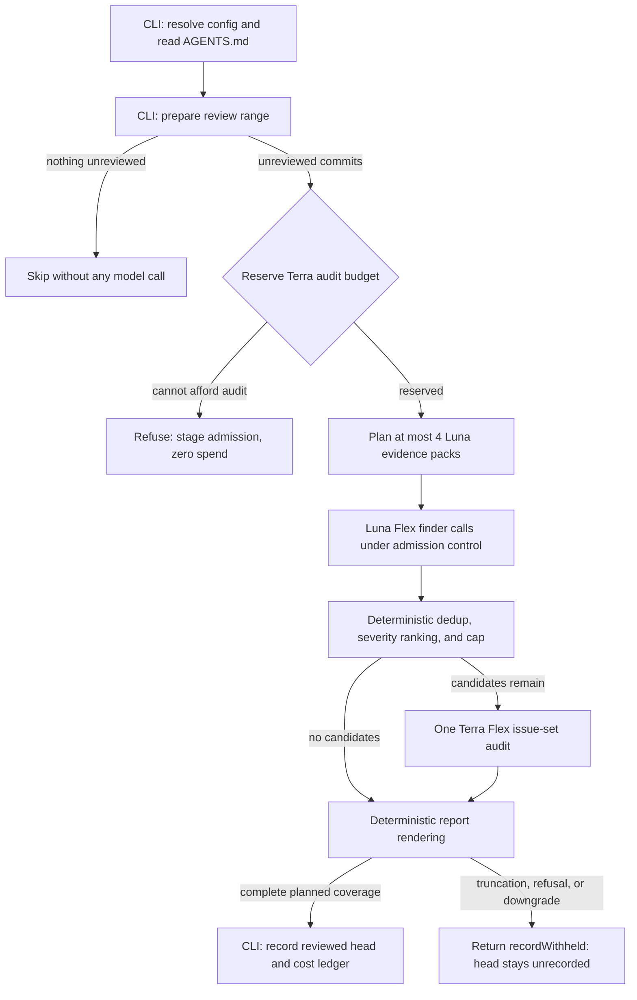

# Dakar

[](
https://deepwiki.com/leynos/dakar)

# 🏜️ Dakar

*Semantic code review that knows exactly what it is allowed to spend.*

Dakar is an [Open Dynamic Workflows](https://github.com/leynos/open-dynamic-workflows)
(ODW) code-review workflow and an installable `dakar-review` command-line
interface (CLI). Deterministic host code owns everything derivable —
configuration, review range, rendering, and history — while two bounded
Flex-tier model lanes do the judgement, under a hard per-review budget
enforced before any call is dispatched.

______________________________________________________________________


## Licence

ISC — see [LICENSE](LICENSE) for details.

______________________________________________________________________

### Installation

```bash
./install.sh   # installs dakar-review globally with Bun
export OPENAI_API_KEY="sk-..."
```


## Contributing

Contributions welcome! Please read [AGENTS.md](AGENTS.md) for the
repository contract and run `make check` before committing.

# Review the current branch's unreviewed commits against origin/main
dakar-review --base origin/main --telemetry


## Quick start


## How a review flows

For screen readers: the following flowchart shows the review pipeline.
The CLI deterministically resolves configuration and prepares the review
range, skipping when nothing is unreviewed. The workflow then reserves
the audit budget, runs up to four bounded Luna Flex finder packs,
compacts candidates deterministically, runs one Terra Flex issue-set
audit, and renders the report deterministically. The CLI records the
reviewed head only after a successful audit.



*Figure 1: The deterministic-tiered review route. Model spend happens
only in the two Flex lanes; every other step is host code, and only a
review with complete planned coverage records the reviewed head.*

______________________________________________________________________

## Why Dakar?

- **A hard cost ceiling, not a cost report**: the Terra audit's worst-case
  estimate is reserved first, every finder call passes admission control,
  and a review that cannot afford its audit refuses before spending
  anything.
- **Deterministic where determinism is possible**: no model is paid to run
  a shell command and echo its JSON. Range preparation, report rendering,
  and review-history recording are host code with tests.
- **One adversarial audit instead of thirty verifier calls**: candidates
  are deduplicated and capped deterministically, then judged as an issue
  set — duplicates merged, causes clustered, performative findings
  rejected.
- **Reviews remember where they stopped**: completed reviews record the
  reviewed head, so the next run reviews only new commits.

______________________________________________________________________


### Basic usage

```bash

# See the resolved policy, lanes, limits, and budget without spending
dakar-review --dry-run
```

The final result is a single JSON object on stdout (or Markdown with
`--format markdown`); progress and telemetry stay on stderr.

______________________________________________________________________


## Features

- CodeRabbit-compatible configuration discovery with documented
  precedence, resolved entirely host-side.
- Repository `AGENTS.md` context, bounded and passed to every prompt with
  Dakar's schema and safety rules taking precedence.
- A per-call cost ledger with a versioned pricing table, worst-case
  estimates at the cache-write band, and the pricing-table version
  recorded on every run.
- Byte-stable deterministic report rendering: the same consolidated
  findings always produce the same report.
- Review-history state under the XDG state directory, recorded through a
  locked, validated append that never trusts workflow-supplied paths.

______________________________________________________________________


## Learn more

- [Documentation contents](docs/contents.md) — the index for the full
  documentation set.
- [User's guide](docs/users-guide.md) — commands, configuration, and
  result interpretation.
- [Developer's guide](docs/developers-guide.md) — building, testing, and
  extending the workflow.
- [ADR 002](docs/adr-002-deterministic-tiered-review-cost.md) — why the
  pipeline is deterministic-first with Flex-tier lanes.
- [Roadmap](docs/roadmap.md) — planned features and progress.

______________________________________________________________________
