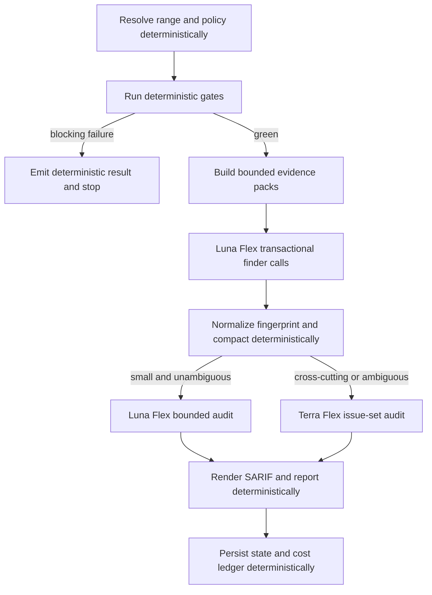

# Architectural decision record (ADR) 002: Prefer deterministic review stages and Flex-tier residual judgement

## Status

Proposed.

## Date

2026-07-10.

## Context and problem statement

Dakar must produce useful semantic code review while keeping the ordinary review
cost below the effective CodeRabbit subscription benchmark of approximately
£0.11 per fully utilized review. The first-pass workflow does not have a
credible hard cost envelope. With its default limits, one run can invoke agents
for configuration resolution, review-range preparation, up to eight finder
tasks, up to thirty candidate verifications, synthesis, and review-history
recording.

The cost problem is structural rather than merely a matter of selecting a
cheaper model. Three patterns create avoidable spend:

- deterministic commands are mediated through agents;
- candidate verification fans out once per candidate; and
- final report rendering uses a model even when accepted findings already
  contain every required field.

The existing Dakar design separates deterministic linting from semantic review
and calls for per-agent cost attribution. This decision tightens that boundary,
changes the default model-routing policy, and makes cost an admission-control
input rather than a retrospective dashboard statistic.

`df12-build` provides the reference operating principle. It host-enforces
selection, gates, state transitions, and integration constraints; spends in
cheapest-first order; uses deterministic classifiers for clear cases; and only
invokes or escalates a model when durable evidence leaves a genuine judgement
call.[^1] Dakar will adopt the same shape for review.

OpenAI Flex processing charges Batch-equivalent token rates in exchange for
slower responses and occasional resource unavailability. Both GPT-5.6 Luna and
GPT-5.6 Terra receive a 50% reduction from standard processing at the decision
date.[^2] This trade suits Dakar's dark-factory operating model: individual turn
latency is secondary to fleet throughput per pound, and waiting work can coexist
with other concurrent agent work.

## Decision outcome

Adopt a deterministic-first review pipeline with three execution lanes:

1. **Deterministic host logic** for every decision that can be derived from
   repository state, configuration, syntax, tool output, or a stable rule.
2. **GPT-5.6 Luna using Flex processing** for bounded, transactional judgements
   that need a model but do not need whole-review reasoning.
3. **GPT-5.6 Terra using Flex processing** for broad, cross-cutting, or
   issue-set-level judgement.

Standard processing is an exceptional acceleration tier. It is disabled by
default and may be selected only by an explicit operator policy with a separate
cost budget and telemetry marker.

The workflow host, not an agent prompt, selects the lane. Agents may report that
input is insufficient, but they may not promote themselves to a more expensive
model or service tier.

The normal pipeline becomes:



Figure 1: Dakar spends model budget only after deterministic preparation and
uses one issue-set audit instead of unbounded per-candidate verification.

The decision removes the following model calls from the normal path:

- configuration resolution;
- review-range preparation;
- review-history recording; and
- final Markdown or JSON rendering.

It also replaces per-candidate Terra-class verification with one bounded
issue-set audit for an ordinary review. A second Terra Flex call requires an
explicit large-review route and enough remaining budget.

## Decision principles

The routing policy follows these rules in order:

1. Prefer a deterministic implementation whenever the same inputs must produce
   the same decision.
2. Prefer a deterministic gate whenever a tool can prove a failure more cheaply
   and reliably than a model can infer it.
3. Use Luna Flex for local, schema-bound judgement with bounded context and
   output.
4. Use Terra Flex for relationships across files, findings, rules, or causes.
5. Reserve the required global audit before spending on optional local calls.
6. Stop or defer rather than silently exceed the configured review budget.
7. Permit zero findings and zero model calls as successful outcomes.
8. Do not optimize for finding count, agent utilization, or reviewer activity.
9. Treat latency as queue inventory, not as permission for unbounded
   concurrency.

Any change that moves an enforceable contract from host code into prompt text
weakens the system. Such a change requires a separate documented rationale.

## Deterministic host boundary

The host owns every operation that can be expressed as code with stable inputs
and testable outputs. This includes:

- resolving the CodeRabbit-compatible configuration path and parsing its YAML;
- calculating the review range and changed-line map;
- classifying changed paths, generated files, vendored files, lockfiles, and
  binary artefacts;
- applying path-scoped instructions and machine-readable policy conditions;
- running configured pre-merge checks, tests, linters, static analysers, and
  security scanners;
- importing tool output, including SARIF, without asking a model to restate it;
- rejecting findings outside the changed range when policy requires changed-line
  scope;
- validating source locations, rule identifiers, required evidence, and schema
  fields;
- exact and structural deduplication using stable fingerprints;
- candidate caps, token estimates, route selection, and cost admission;
- disposition application, SARIF assembly, report rendering, and state
  persistence; and
- retry bookkeeping, idempotency, telemetry, and pricing-table application.

A natural-language rule does not automatically require a model. The host should
first convert stable policy clauses into executable predicates. A model is
appropriate only for residual ambiguity, such as whether a local exception is
truly temporary or whether two technically distinct findings share one
underlying design cause.

### Deterministic gate short-circuit

In the default agentic-loop mode, a blocking deterministic failure stops the
semantic review before Luna or Terra is called. The result contains the failed
commands, structured findings, and enough evidence for the implementation agent
to repair the branch. A later review evaluates the repaired head.

An operator may enable `reviewOnDeterministicFailure` for a human-oriented batch
review, but the default remains `false`. The override and its extra spend must be
visible in telemetry.

This mirrors the `df12-build` policy of running host gates before scarce
reviewer agents and avoiding reviewer spend when cheaper evidence already
blocks the work.[^1]

## Luna Flex transactional boundary

Use `gpt-5.6-luna` with `service_tier = "flex"` for non-deterministic work that
is transactional. A transaction must be:

- idempotent and free of repository writes;
- schema-bound;
- scoped to one evidence pack or one small candidate batch;
- independent of global issue-set relationships;
- cheap to retry from the same durable input; and
- subject to strict input, output, and call-count limits.

Default transaction limits are configuration, not prompt suggestions:

```json
{
  "lunaModel": "gpt-5.6-luna",
  "lunaServiceTier": "flex",
  "lunaReasoningEffort": "low",
  "transactionMaxFiles": 5,
  "transactionMaxInputTokens": 12000,
  "transactionMaxOutputTokens": 750,
  "maxLunaFlexCalls": 4
}
```

Typical Luna Flex transactions are:

- finding candidate defects in one bounded source, test, configuration, or
  documentation evidence pack;
- deciding whether a candidate's cited policy clause plausibly applies when the
  clause cannot yet be encoded deterministically;
- checking a small candidate batch against nearby source and diff evidence;
- assigning a concise causal category or fix hint when deterministic templates
  are inadequate; and
- auditing a very small, single-area issue set that has no cross-file or
  cross-rule relationships.

Luna does not perform final synthesis, state transitions, shell-command relay,
or repository-wide root-cause analysis. Transactional calls return concise
structured data. Prose is not the workflow contract.

## Terra Flex boundary

Use `gpt-5.6-terra` with `service_tier = "flex"` for tasks whose value comes from
holding a larger evidence graph in one deliberation. The default Terra task is
the adversarial issue-set audit.

The audit receives:

- the changed-line map and compact diff evidence;
- applicable repository instructions and policy clauses;
- deterministic gate results;
- normalized Luna candidates;
- semantic and location fingerprints; and
- the remaining cost budget.

It must:

- deduplicate semantically overlapping findings;
- identify common underlying causes without inventing abstractions;
- test each finding's evidence, rule interpretation, scope, and severity for
  internal consistency;
- evaluate whether the proposed fix improves the codebase after complexity,
  churn, and maintenance cost;
- reject performative or tryhard findings;
- cluster surviving findings into remediation units; and
- state explicitly when no actionable issue remains.

The audit may add an omitted cross-cutting finding only when it cites concrete
changed-range evidence. It is not rewarded for issue volume.

Default Terra limits are:

```json
{
  "terraModel": "gpt-5.6-terra",
  "terraServiceTier": "flex",
  "terraReasoningEffort": "medium",
  "terraMaxInputTokens": 48000,
  "terraMaxOutputTokens": 2500,
  "maxTerraFlexCalls": 1,
  "maxTerraFlexCallsLargeReview": 2
}
```

High reasoning is an escalation, not the default. It requires unresolved
high-impact evidence, a recorded escalation reason, and enough remaining budget
under the worst-case output estimate.

## Codex CLI adapter contract

Codex CLI exposes `service_tier` as a configuration value and accepts per-call
configuration overrides through `-c key=value`.[^3] Dakar therefore does not
need a bespoke Responses API wrapper solely to select Flex.

The ODW configuration should define distinct Luna Flex and Terra Flex adapters,
or one Flex adapter with host-enforced model and reasoning arguments. A
representative adapter is:

```json
{
  "codex-flex": {
    "label": "Codex CLI, Flex processing",
    "command": [
      "codex",
      "exec",
      "--skip-git-repo-check",
      "--sandbox",
      "workspace-write",
      "--cd",
      "{workspace}",
      "-c",
      "service_tier=\"flex\"",
      "-c",
      "model_reasoning_effort=\"medium\"",
      "-"
    ],
    "stdin": "{prompt}",
    "flags": {
      "model": ["--model"]
    }
  }
}
```

The host must record the requested service tier, model, reasoning effort, and
provider-reported usage for every call. Adapter contract tests must prove that
`service_tier = "flex"` reaches the Codex effective configuration.

## Flex scheduling and failure policy

Flex processing trades latency and availability for lower token prices. Dakar
must treat Flex availability as an explicit workflow condition rather than a
generic agent failure.

The dark-factory scheduler follows these rules:

1. Queue model work by model, service tier, repository, review, and idempotency
   key.
2. Enforce configurable per-model and global concurrency ceilings.
3. Allow workers waiting on Flex capacity to yield and process independent work.
4. Retry `429 Resource Unavailable` with bounded exponential backoff and positive
   jitter.
5. Record every attempt and provider request identifier.
6. Do not charge a resource-unavailable attempt to the estimated token ledger;
   OpenAI does not bill that failure.[^2]
7. Do not silently retry with standard processing.
8. After the configured Flex attempts are exhausted, defer the affected stage
   and leave the reviewed head unrecorded as complete when that stage is
   required.

Default retry and concurrency controls are host configuration:

```json
{
  "flexAttempts": 6,
  "flexInitialBackoffSeconds": 30,
  "flexMaxBackoffSeconds": 900,
  "flexJitterSeconds": 30,
  "maxConcurrentLunaFlexCalls": 16,
  "maxConcurrentTerraFlexCalls": 4,
  "allowStandardFallback": false
}
```

These values are starting points for measurement, not claims about provider
capacity. Increasing concurrency must depend on observed completion throughput,
resource-unavailable rate, and provider rate limits. Unbounded fan-out merely
turns a TARDIS into a very expensive broom cupboard.

An operator may enable standard fallback only through an explicit acceleration
policy. The fallback must have a separate higher budget, a maximum call count,
and an unmistakable telemetry flag. It is never the cost-reduction default.

A Luna fallback for a Terra task is permitted only when the host can prove that
the remaining audit fits the transactional boundary. Otherwise the correct
result is a structured deferred review rather than an underpowered global
judgement.

## Cost budget and admission control

The economic benchmark is a configurable value, initially
`targetCostPerReviewGbp = 0.11`. Dakar's operating targets for ordinary
incremental reviews are:

- mean provider cost at or below £0.05;
- 95th-percentile provider cost at or below £0.08;
- a hard ordinary-review budget of £0.10; and
- no admitted call whose worst-case estimate would breach the remaining budget.

The expected steady-state objective is approximately £0.025 to £0.04 for the
token profile previously estimated for the deterministic-tiered route. The
acceptance thresholds remain deliberately looser until measured review traces
replace modelling assumptions.

Large reviews use an explicit larger budget or return a partial or deferred
result. They must not consume an unbounded number of partitions merely because
the diff is large.

The route planner reserves the required issue-set audit before dispatching
optional Luna calls. Before each model request, it estimates the worst-case cost
from:

- model and service tier;
- short- or long-context pricing band;
- uncached input tokens;
- eligible cached input tokens;
- cache-write tokens;
- maximum output tokens; and
- configured regional-processing uplift.

Provider prices and foreign-exchange rates are versioned data, not constants in
this ADR. Every review records the pricing-table version and foreign-exchange
snapshot used for its estimate.

At the decision date, the short-context rates provide the economic rationale:

| Route | Input / 1M | Cached input / 1M | Cache writes / 1M | Output / 1M |
| - | -: | -: | -: | -: |
| Luna standard | $1.00 | $0.10 | $1.25 | $6.00 |
| Luna Flex | $0.50 | $0.05 | $0.625 | $3.00 |
| Terra standard | $2.50 | $0.25 | $3.125 | $15.00 |
| Terra Flex | $1.25 | $0.125 | $1.5625 | $7.50 |

Table 1: OpenAI short-context prices on 2026-07-10; the runtime pricing table,
not this snapshot, governs admission.[^4]

Flex halves the price of both selected models. Luna Flex costs 40% as much per
token as Terra Flex, so the model-routing distinction remains economically
important even when both use the same service tier.

Cost metrics must include:

- cost per review;
- cost per changed file and changed diff token;
- cost per candidate and accepted semantic finding;
- cost of discarded and duplicate candidates;
- cost by stage, model, service tier, and retry attempt;
- Flex queue delay and completion throughput; and
- runner or orchestration cost separately from provider inference cost.

Cost per finding is an observation, not an optimization target. Optimizing for
that ratio would reward issue manufacture.

## Findings and hand-off format

Structured findings remain the durable inter-stage contract. Dakar should use
SARIF 2.1.0 as the canonical evidence envelope and add namespaced properties for
review deliberation.

The host assigns and preserves:

- exact finding identity;
- semantic fingerprint;
- source task and source model;
- model service tier and reasoning effort;
- evidence provenance;
- issue cluster identifier;
- disposition;
- estimated and reported cost; and
- pricing-table version.

Agent outputs are immutable inputs to later stages. The Terra audit emits a new
run or audit record that references candidate identifiers; it does not rewrite
Luna history in place. Final Markdown, JSON, and GitHub annotations are
deterministic projections of the consolidated SARIF data.

## Consequences

Positive consequences:

- Deterministic work becomes cheaper, reproducible, and easier to test.
- Every default model call receives Flex rather than standard pricing.
- The maximum model fan-out is bounded by host configuration.
- One issue-set critic can reason about duplicates and causes that isolated
  per-candidate verifiers cannot see.
- Luna Flex preserves a strong cost advantage for bounded local judgement.
- Terra-quality broad review becomes economically plausible through Flex rates.
- Fleet concurrency can absorb individual request latency without paying the
  standard-processing premium.
- Failed Flex capacity does not silently convert into a budget breach.
- Review provenance and cost become auditable at the call and finding level.
- A no-action review remains a valid and inexpensive outcome.
- Codex CLI can select Flex directly, avoiding a bespoke API-wrapper subsystem.

Negative consequences:

- Dakar must own more host-side parsing, routing, queueing, and policy code.
- Deterministic short-circuiting may delay semantic findings until the next head
  after a blocking gate is fixed.
- Flex processing can increase wall-clock latency and occasionally defer a
  review.
- High fleet concurrency can amplify provider limits unless the host applies
  backpressure.
- Luna may miss a subtle local defect that a larger model would catch.
- Model and pricing changes require maintained routing evaluations and versioned
  pricing data.
- Deterministic SARIF rendering gives less freedom for ornamental prose, which
  is an acceptable loss.

## Options considered

### Keep the current routed finder and per-candidate verifier pipeline

Rejected. Its cost grows with candidate count, and isolated verifiers cannot
perform issue-set deduplication or root-cause consolidation well.

### Use Luna standard and Terra Flex

Rejected. Luna Flex receives the same 50% service-tier discount, and Dakar does
not require interactive latency for transactional stages. Standard Luna would
pay twice as much for no material dark-factory benefit.

### Use standard processing for all semantic stages

Rejected. It makes the £0.11 benchmark unnecessarily difficult and optimizes
individual response latency rather than useful fleet throughput per pound.

### Use Terra Flex for every model call

Rejected. Flex is the correct default service tier, but Terra remains 2.5 times
the token price of Luna. Small, local judgements do not justify the larger model.

### Use Luna Flex for the complete review

Rejected. Luna is appropriate for bounded transactions, but whole-review causal
analysis, adversarial consolidation, and cross-file architecture review need a
larger-context and stronger-judgement route.

### Retain agents as wrappers around deterministic commands

Rejected. A model should not be paid to execute a known command and echo its
JSON. The host can run, validate, and record the same operation directly.

### Use the Batch API for all model work

Rejected as the default. Batch offers the same price class but a different
operating contract. Flex retains the synchronous request shape expected by ODW
while allowing slower processing and queueing behind the adapter.

### Fall back automatically to standard processing

Rejected. Automatic fallback converts provider scarcity into an uncontrolled
cost multiplier. A deadline-sensitive operator may opt into acceleration under
a separate budget.

### Continue semantic review after every deterministic blocker

Rejected as the default for agentic loops. The implementation agent can repair
the cheaper, proven blocker and request another incremental review. The
behaviour remains available as an explicit human-review override.

## Migration

Implement the decision in independently testable steps:

1. Land the versioned pricing table and per-call cost ledger.
2. Move configuration resolution, range preparation, and history recording from
   agent calls into host code.
3. Parse configured deterministic checks and import their structured results.
4. Add explicit Luna Flex and Terra Flex Codex CLI adapters using
   `-c 'service_tier="flex"'`.
5. Add the bounded Flex work queue, concurrency controls, idempotency keys,
   backoff, and jitter.
6. Replace per-candidate verifier fan-out with deterministic compaction followed
   by one issue-set audit.
7. Render final reports deterministically from consolidated SARIF.
8. Add route, queue, and budget dry-run output before enabling the new route by
   default.
9. Compare old and new routes on redacted, adjudicated self-review fixtures.
10. Remove the old route after the cost and quality acceptance criteria hold
    over a representative review corpus.

During migration, the workflow may retain a `routingPolicy` feature flag with
`legacy` and `deterministic-flex-v1` values. Every result must record the
selected policy.

## Verification

An implementation branch for this decision must include tests proving that:

- a blocking deterministic gate launches no Luna or Terra calls by default;
- configuration, range preparation, rendering, and recording do not call a
  model;
- a small bounded review routes to Luna Flex;
- a cross-cutting or multi-candidate review routes to Terra Flex;
- Codex effective configuration contains `service_tier = "flex"` for both model
  lanes;
- no ordinary review launches more than the configured Luna and Terra caps;
- queue concurrency never exceeds the configured per-model or global limits;
- a Flex resource-unavailable response retries with bounded backoff and never
  silently uses standard processing;
- an exhausted required Terra audit leaves the head unrecorded as completely
  reviewed;
- the admission controller rejects an optional call that would exceed the hard
  budget;
- SARIF identifiers and provenance survive all stages unchanged;
- deterministic rendering is byte-stable for the same consolidated input; and
- pricing estimates distinguish reported usage from estimates and retain their
  pricing-table version.

The route may become the default only when an adjudicated evaluation corpus
shows:

- no material regression in high-severity recall;
- equal or better precision after issue-set auditing;
- lower duplicate and convention-only finding rates;
- mean ordinary-review provider cost at or below £0.05;
- 95th-percentile ordinary-review provider cost at or below £0.08; and
- stable or improving completed useful reviews per pound as concurrency rises.

A live review is not a routine documentation gate because it incurs provider
spend. Adapter contract tests, deterministic fixtures, and recorded evaluation
runs provide the normal verification path.

## References

- [`leynos/df12-build`, `docs/architecture.md`][df12-build-architecture]
- [`leynos/df12-build`, ADR 002][df12-build-adr-002]
- [OpenAI Flex processing][openai-flex]
- [OpenAI API pricing][openai-pricing]
- [Codex configuration reference][codex-config]
- [`docs/dakar-review-design.md`](dakar-review-design.md)
- [`docs/roadmap.md`](roadmap.md)

[^1]: `df12-build` distinguishes host-enforced contracts from prompt-enforced
    instructions, runs deterministic gates before reviewer agents, and reserves
    stronger models for genuinely ambiguous assessment or triage.
[^2]: OpenAI documents Flex as lower-cost processing with slower responses and
    occasional resource unavailability, priced at Batch rates. A `429 Resource
    Unavailable` response is not billed.
[^3]: Codex documents `service_tier` as a configuration key whose built-in
    values include `flex`. CLI `-c key=value` overrides can set it per call.
[^4]: Prices are per million tokens for short-context requests and may change.
    Regional processing and long-context requests can cost more.

[df12-build-architecture]: https://github.com/leynos/df12-build/blob/main/docs/architecture.md
[df12-build-adr-002]: https://github.com/leynos/df12-build/blob/main/docs/adr-002-assess-partial-task-branches.md
[openai-flex]: https://developers.openai.com/api/docs/guides/flex-processing
[openai-pricing]: https://developers.openai.com/api/docs/pricing
[codex-config]: https://learn.chatgpt.com/docs/config-file/config-reference
