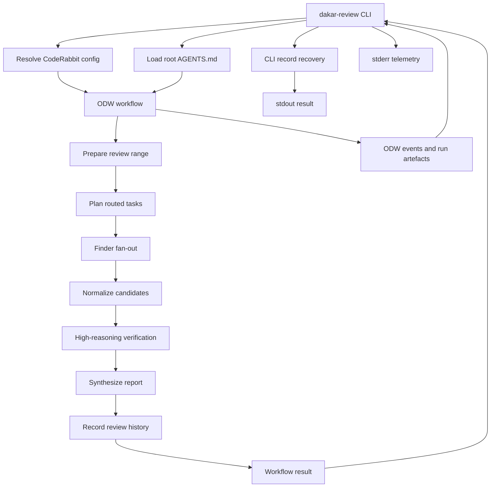
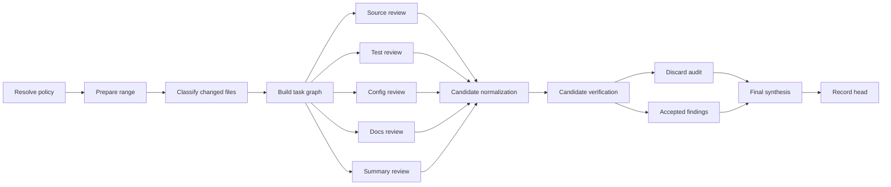

# Dakar review design

Status: Living design
Audience: Developers implementing and operating Dakar review workflows
Date: 2026-06-30
Companion documents:
[`docs/users-guide.md`](users-guide.md),
[`docs/developers-guide.md`](developers-guide.md),
[`docs/design/initial-workflow.md`](design/initial-workflow.md), and
[`docs/roadmap.md`](roadmap.md)

## 1. Problem

Dakar runs an Open Dynamic Workflows (ODW) code review over the commits that
have not already been reviewed on a branch. It uses a CodeRabbit-compatible
YAML policy, repository-local agent instructions, and routed Codex agents to
produce one actionable review report. The workflow must avoid re-reviewing the
same commits, make weak or discarded findings auditable, and expose enough
telemetry to decide whether the approach can beat CodeRabbit's user-supplied
benchmark of USD 0.25 per reviewed file.

Dakar is not a deterministic linter. The separate `odw-lint` project should
own formatting, spelling, line-count, schema, and other rules that can be
checked without judgement. Dakar should focus review budget on behavioural
regressions, orchestration failures, security boundaries, missing context,
incorrect assumptions, and gaps where no deterministic tool is configured yet.

## 2. Goals and non-goals

Goals:

- Review only the unreviewed commit range for the current branch.
- Use CodeRabbit YAML and root `AGENTS.md` as review context.
- Route review work by task shape instead of sending every agent the full
  diff.
- Verify candidate findings before synthesis, and discard weak findings with
  recorded reasons.
- Record completed heads in XDG state so a later run advances from the last
  reviewed commit.
- Preserve a stable CLI contract: final JSON or Markdown on stdout, telemetry
  on stderr.
- Capture per-agent telemetry and cost data so routing choices can be
  evaluated against a per-file cost target.

Non-goals:

- Post pull request comments directly.
- Replace deterministic linting, formatting, or static analysis.
- Trust a light model to decide whether a proof is substantive.
- Treat `reportMarkdown` as a schema. Structured consumers must read
  `findings`, `discarded`, `verdicts`, `metrics`, and `recorded`.

## 3. Terminology

- Review range: the commit interval Dakar reviews, normally
  `last-reviewed-head..HEAD` or `merge-base(base, HEAD)..HEAD`.
- Candidate: a proposed finding from a finder task. Candidates are untrusted
  until verified.
- Verdict: a verifier decision about one candidate. Verdicts can accept,
  downgrade, reject, or mark a candidate as needing a human.
- Finding: a verified issue included in the final actionable output.
- Discard: a rejected candidate with a reason. Discards are audit data, not
  review instructions.
- Agent call: one ODW `agent()` invocation, including its model, adapter,
  phase, prompt, result, and telemetry.
- Review ledger: persistent per-run and per-agent telemetry used for
  evaluation and cost accounting.

## 4. Architecture

Dakar uses a routed fan-out, verify, and synthesize pipeline. Deterministic
range and state logic live in Node helpers. ODW owns orchestration and agent
handoffs. The CLI owns installation, user-friendly invocation, telemetry
streaming, root `AGENTS.md` loading, and deterministic record recovery.



Figure 1: Dakar separates deterministic CLI and helper work from ODW agent
orchestration. The CLI can repair review-history recording after a workflow
record-phase failure.

The first implementation keeps the ODW workflow in one file because ODW files
cannot be treated as ordinary importable JavaScript modules. The current
workflow still exceeds the CodeRabbit JavaScript size rule. That is a real
maintainability concern, but the fix must preserve ODW's dialect constraints:
literal `meta`, injected primitives, top-level `return`, and no Node imports.
The roadmap treats workflow decomposition as a designed refactor rather than a
mechanical lint fix.

## 5. Review pipeline



Figure 2: Finder tasks propose candidates. Only verifier-approved candidates
become findings.

The task graph starts with deterministic file classification because it gives
repeatable fan-out and keeps prompt scope small. Source and dependency-impact
tasks route to `gpt-5.5` high. Test tasks route to `gpt-5.5` medium. Config
and documentation tasks route to smaller agents. A summary task scans the whole
change set for cross-cutting risks. The high-reasoning verifier remains the
gate before synthesis.

The finder prompt should ask for candidates that a deterministic tool is
unlikely to catch. A deterministic policy violation can still appear when no
configured gate covers it, but synthesis should not let spelling, formatting,
or line-count issues dominate the report.

## 6. Repository policy and AGENTS.md

Configuration resolution uses this precedence:

1. Explicit CLI `--config`.
2. Repository-local CodeRabbit YAML names.
3. User-level `$XDG_CONFIG_HOME/dakar/config.yaml` or
   `~/.config/dakar/config.yaml`.
4. Dakar's bundled example config.

Explicit config paths must exist. Silent acceptance of a missing policy file is
a review integrity bug because agents then appear to follow a policy they never
loaded.

The CLI reads a root `AGENTS.md` from the reviewed repository and passes it as
`agentInstructions`. Finder, verifier, and synthesis prompts include that text
as context. Dakar workflow schema rules, output contracts, and safety rules
take precedence over repository instructions. Future work should support
path-scoped `AGENTS.md` files, but the root file is enough to make the first
review pass aware of repository-level conventions.

## 7. Review-history state

Review history is stored under:

```plaintext
$XDG_STATE_HOME/dakar/<repo-owner>/<repo-name>/<branch-slug>/reviews.toml
```

When `XDG_STATE_HOME` is unset, Dakar uses `~/.local/state`. Each completed
review appends a TOML `[[reviews]]` entry containing the reviewed head commit,
base commit, changed files, model set, findings count, summary, and metrics
JSON.

The invariant is simple: once Dakar reports a review as successfully recorded,
a later prepare step on the same branch must not include the recorded head's
ancestors again. Record failure must be visible. The CLI therefore attempts one
deterministic recovery when the workflow returns a completed review with
`recorded.ok` false. Recovered results set `recorded.recoveredBy` to
`dakar-review` and `metrics.recordRecoveredByCli` to `true`.

## 8. Telemetry and cost accounting

ODW currently stores a run-level `spentTokens` count in `status.json` and event
records with phase, label, adapter, timestamps, and attempts. That is enough to
trend total run size, but not enough to compare agent roles or routing
strategies.

Dakar needs a review ledger with one record per agent call. The ledger fields
are:

- `runId`, `agentCallId`, `phase`, and `label`, to join telemetry to ODW events
  and workflow output.
- `taskId`, `taskKind`, and `files`, to attribute cost to review scope.
- `adapter`, `model`, and `reasoning`, to compare high, medium, mini, and
  spark routes.
- `startedAt`, `finishedAt`, `durationMs`, and `attempts`, to measure latency
  and retry cost.
- `promptBytes` and `contextBytes`, to estimate context growth and prefix-cache
  opportunities.
- `inputTokens`, `cachedInputTokens`, `outputTokens`, and `spentTokens`, to
  compute usage when the adapter exposes it. Estimated values must be marked as
  estimates.
- `candidateCount`, `acceptedCount`, and `discardedCount`, to relate spend to
  useful review output.
- `estimatedCostUsd`, to apply a local pricing table for model-specific cost
  comparisons.

Cost recovery has three layers:

- Budget control: cap tasks, candidates, verifier fan-out, and synthesis depth.
- Attribution: record cost per task kind, model, file, candidate, and accepted
  finding.
- Evaluation: compare observed `estimatedCostUsd / changedFileCount` against
  the USD 0.25 per-file target supplied for CodeRabbit.

The cost model must store the pricing table version used for each estimate.
Provider prices change, so old runs must remain auditable without rewriting
history.

## 9. Making reviews more useful to agents

A useful Dakar review should help an implementation agent decide what to fix
next. The report should prioritize:

- defects that can change runtime behaviour;
- command, shell, state, and trust-boundary errors;
- missing context that makes the workflow review the wrong range or wrong
  policy;
- false-positive patterns that should be routed to discard rules;
- tests that fail to isolate global state, persistent state, or external
  services;
- deterministic gaps only when no deterministic gate currently owns them.

The report should avoid:

- repeating formatting or spelling findings already covered by lint;
- treating file-size policy as a semantic blocker without an architectural
  migration path;
- listing every candidate when the verifier has already discarded it;
- hiding record or telemetry failures behind an otherwise useful report.

Each accepted finding should answer four questions: what is wrong, where it is,
why it matters, and what evidence proves it. Each discarded finding should
answer why it was rejected so prompt and routing changes can reduce similar
noise later.

## 10. Interfaces

The CLI contract remains:

```bash
dakar-review --repo-root "$PWD" --base origin/main
dakar-review --repo-root "$PWD" --base origin/main --telemetry
```

Stdout contains only the final result in JSON by default or `reportMarkdown`
when `--format markdown` is selected. Stderr contains progress, ODW run ids,
telemetry, and process-level errors.

The workflow result contains:

- `findings`: actionable accepted findings;
- `discarded`: rejected candidates with reasons;
- `verdicts`: verifier decisions;
- `metrics`: run metrics and model assignment data;
- `recorded`: review-history write result;
- `recordInput`: the deterministic payload needed to retry recording.

`reportMarkdown` is presentation text. It has no deterministic schema.

## 11. Failure modes

- Missing explicit config: the CLI or config phase fails before review.
- Prepare cannot compute a range: the workflow returns `stage: "prepare"` and
  launches no review fan-out.
- Finder emits weak candidates: the verifier discards them and synthesis
  reports discard counts.
- Verifier references an unknown id: the workflow records an
  `unknown_candidate` discard instead of crashing.
- Record agent fails: the workflow returns `stage: "record"` with
  `recordInput`; the CLI attempts one deterministic recovery.
- Telemetry follow times out: the CLI exits non-zero and leaves the ODW run
  inspectable by run id.

## 12. Verification targets

The implementation must preserve these invariants:

- Review ranges do not include commits at or before the last recorded head that
  is an ancestor of `HEAD`.
- Missing value-bearing CLI flags fail instead of becoming boolean `true`.
- Shell commands generated for agents quote user-controlled refs and paths.
- Unknown verifier candidate ids do not abort synthesis.
- Stdout contains one final result object or Markdown report, never progress
  text.
- A completed review with failed recording either gets recovered by the CLI or
  exits non-zero with `stage: "record"`.
- Telemetry and cost fields mark estimated token counts differently from
  adapter-reported token counts.

The first implementation verifies these with focused Node tests and ODW
dry-run checks. Future telemetry work needs end-to-end fixtures that exercise
quiet mode, telemetry mode, failed record recovery, AGENTS-aware prompting,
and pricing-table changes in combination.

## 13. References

- [CodeRabbit configuration reference](https://docs.coderabbit.ai/reference/configuration)
- [XDG Base Directory Specification](https://specifications.freedesktop.org/basedir/)
- [SARIF 2.1.0](https://docs.oasis-open.org/sarif/sarif/v2.1.0/sarif-v2.1.0.html)
- [SWR-Bench](https://www.semanticscholar.org/paper/2affab64adb964bef66df6e99be3db601b8256ff)
- [Agentic Code Review](https://www.semanticscholar.org/paper/b3c711a5b7583853784ced9a5ea4ad20ef2811b9)
- [Runtime-Structured Task Decomposition](https://www.semanticscholar.org/paper/a3e5974206faef2d75679a2a4ded4cd3d3c099a6)
