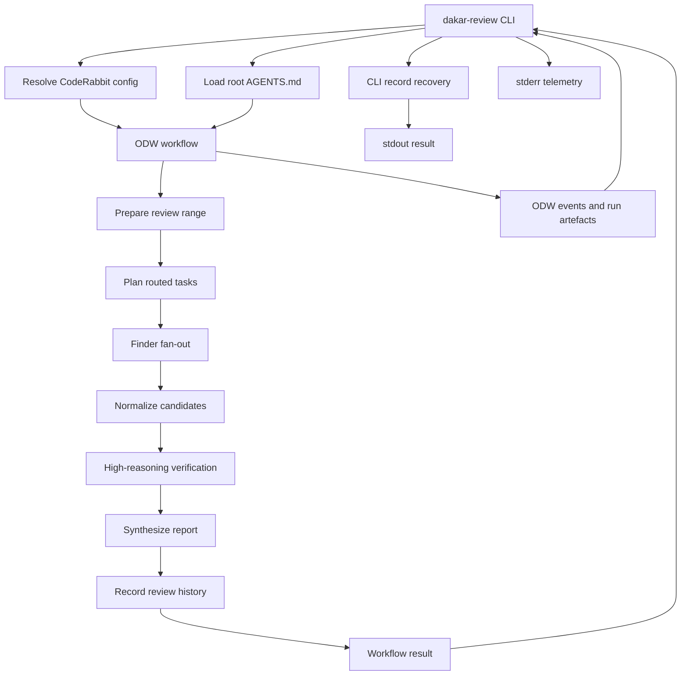
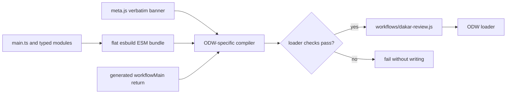
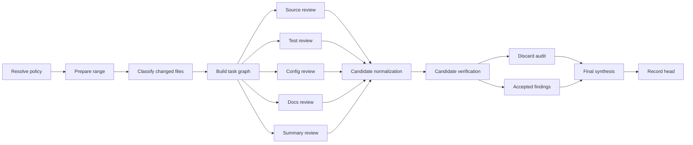

# Dakar review design

Status: Living design
Audience: Developers implementing and operating Dakar review workflows
Date: 2026-07-14
Companion documents:
[`docs/users-guide.md`](users-guide.md),
[`docs/developers-guide.md`](developers-guide.md),
[`docs/design/initial-workflow.md`](design/initial-workflow.md), and
[`docs/roadmap.md`](roadmap.md)
Accepted decision record:
[`docs/adr-001-compile-odw-workflow-from-typescript.md`](adr-001-compile-odw-workflow-from-typescript.md)

## 1. Problem

Dakar runs an Open Dynamic Workflows (ODW) code review over the commits that
have not already been reviewed on a branch. It uses a CodeRabbit-compatible
YAML policy, repository-local agent instructions, and routed agents to
produce one actionable review report. The workflow must avoid re-reviewing the
same commits, make weak or discarded findings auditable, and expose enough
telemetry to decide whether the approach can beat CodeRabbit's user-supplied
benchmark.

> **Superseded benchmark framing.** The original per-file benchmark below
> (USD 0.25 per reviewed file) predates
> [ADR 002](adr-002-deterministic-tiered-review-cost.md), which reframes cost
> as a hard **per-review** budget (`budgetGbp`, default £0.10, with mean and
> 95th-percentile targets of £0.05 and £0.08) rather than a per-file ratio.
> The `api-key-support` ExecPlan's USD 0.25 acceptance and USD 0.11 stretch
> figures are independent per-review USD delivery goals chosen for that
> plan, not currency conversions of ADR 002's GBP targets; see the ExecPlan's
> "Purpose / big picture" section for the reconciliation and the worst-case
> arithmetic (about USD 0.133 at default caps). §8 below names the ledger
> fields that carry the implemented accounting.

Dakar is not a deterministic linter. The separate `odw-lint` project should
own formatting, spelling, line-count, schema, and other rules that can be
checked without judgement. Dakar should focus review budget on behavioural
regressions, orchestration failures, security boundaries, missing context,
incorrect assumptions, and gaps where no deterministic tool is configured yet.

## 2. Goals and non-goals

Goals:

- Review only the unreviewed commit range for the current branch.
- Use CodeRabbit YAML and root `AGENTS.md` as review context.
- Route review work by task shape instead of sending every agent the full
  diff.
- Verify candidate findings before synthesis, and discard weak findings with
  recorded reasons.
- Record completed heads in XDG state so a later run advances from the last
  reviewed commit.
- Preserve a stable CLI contract: final JSON or Markdown on stdout, telemetry
  on stderr.
- Capture per-agent telemetry and cost data so routing choices can be
  evaluated against a per-file cost target.

Non-goals:

- Post pull request comments directly.
- Replace deterministic linting, formatting, or static analysis.
- Trust a light model to decide whether a proof is substantive.
- Treat `reportMarkdown` as a schema. Structured consumers must read
  `findings`, `discarded`, `verdicts`, `metrics`, and `recorded`.

## 3. Terminology

- Review range: the commit interval Dakar reviews, normally
  `last-reviewed-head..HEAD` or `merge-base(base, HEAD)..HEAD`.
- Candidate: a proposed finding from a finder task. Candidates are untrusted
  until verified.
- Verdict: a verifier decision about one candidate. Verdicts can accept,
  downgrade, reject, or mark a candidate as needing a human.
- Finding: a verified issue included in the final actionable output.
- Discard: a rejected candidate with a reason. Discards are audit data, not
  review instructions.
- Agent call: one ODW `agent()` invocation, including its model, adapter,
  phase, prompt, result, and telemetry.
- Review ledger: persistent per-run and per-agent telemetry used for
  evaluation and cost accounting.

## 4. Architecture

> **Superseded pipeline shape.**
> [ADR 002](adr-002-deterministic-tiered-review-cost.md) moved
> configuration resolution, range preparation, report rendering, and
> history recording out of the ODW workflow entirely; they are now
> deterministic CLI code with no model calls, run before and after `odw
> run` rather than as agent-wrapped phases inside it. The workflow's own
> phases are now Plan, Review, and Audit (one issue-set audit call replaces
> per-candidate verification). Figure 1 and its prose below describe the
> pre-ADR-002 shape for historical context; see
> [`docs/developers-guide.md`](developers-guide.md) §§2-4 for the current
> module and phase map.

Dakar uses a routed fan-out, verify, and synthesize pipeline. Deterministic
range and state logic live in Node helpers. ODW owns orchestration and agent
handoffs. The CLI owns installation, user-friendly invocation, telemetry
streaming, root `AGENTS.md` loading, and deterministic record recovery.



Figure 1: Dakar separates deterministic CLI and helper work from ODW agent
orchestration. The CLI can repair review-history recording after a workflow
record-phase failure. **This figure predates ADR 002**; under the current
`deterministic-flex-v1` route, Resolve CodeRabbit config, Prepare review
range, Synthesize report, and Record review history all run as CLI host
code around a workflow whose only phases are Plan, Review (Luna Flex finder
fan-out), and Audit (one Terra Flex issue-set audit); the CLI records every
successful result directly rather than only recovering after a failure.

The CLI also owns the model-call timeout boundary. The packaged
`odw.config.json` remains unchanged on disk; for each CLI-started run,
`scripts/odw-config.mjs::deriveOdwConfig()` copies it and stamps the clamped
`--per-call-timeout` value onto only the three pi Flex adapters. The CLI passes
that same value into the workflow configuration, keeping ODW's adapter timeout
aligned with the deterministic retry and worst-case wall-clock calculation.
Direct ODW invocation bypasses this host derivation and must provide an
equivalent adapter timeout itself.

ODW still receives one workflow file, but that runtime constraint does not
require one source file. ADR 001 establishes typed source modules under
`src/workflows/dakar-review/` and a small compiler that produces the committed
`workflows/dakar-review.js` artefact. The build concatenates a verbatim literal
metadata banner, a flat esbuild bundle rooted at `main.ts`, and a generated
`return await workflowMain()` footer.

The following diagram shows the source-of-truth boundary. Screen readers should
read it from left to right: contributors edit the source modules, the compiler
checks and frames them, and ODW loads only the generated artefact.



Figure 2: TypeScript modules are development-time source; the checked,
committed JavaScript artefact is the runtime interface.

`main.ts` remains the only composition root and the only source module that
calls injected ODW primitives. Pure modules own schemas, argument defaults,
model routing, task planning, prompt construction, candidate normalization,
and verdict reduction. `main.ts` imports subsystem functions and passes
run-scoped configuration through explicit parameters; modules do not import
`main.ts` or reach into mutable globals. Candidate containment remains
upstream of verifier command construction, and shell quoting remains one shared
authority.

The generated artefact is never hand-edited. It remains committed because the
installed CLI and direct ODW users need a ready workflow without TypeScript or
esbuild at runtime. `docs/design/initial-workflow.md` defines the component
contracts, while ADR 001 records why compilation is the selected boundary.

## 5. Review pipeline

> **Superseded by ADR 002.** Figure 3 and the per-kind model routing
> described below are the pre-ADR-002 shape, kept for historical context and
> still visible as the illustrative `--dry-run` task graph
> (`defaultTaskGraph()`). The live `deterministic-flex-v1` route instead
> packs changed files into homogeneous Luna Flex finder evidence packs
> (`buildFlexFinderPlan()`, capped at `maxLunaFlexCalls x
> transactionMaxFiles`), deterministically compacts the resulting
> candidates (`compactForAudit()`: dedup, severity order, `maxAuditCandidates`
> cap), and sends the survivors to one Terra Flex issue-set audit rather
> than one verification call per candidate. See
> [`docs/developers-guide.md`](developers-guide.md) §4 for the current
> routing.



Figure 3: Finder tasks propose candidates. Only verifier-approved candidates
become findings. This diagram shows the pre-ADR-002 per-candidate
verification and synthesis shape; see the superseded-content note above.

The task graph starts with deterministic file classification because it gives
repeatable fan-out and keeps prompt scope small. Source and dependency-impact
tasks route to `gpt-5.5` high. Test tasks route to `gpt-5.5` medium. Config
and documentation tasks route to smaller agents. A summary task scans the whole
change set for cross-cutting risks. The high-reasoning verifier remains the
gate before synthesis.

The finder prompt should ask for candidates that a deterministic tool is
unlikely to catch. A deterministic policy violation can still appear when no
configured gate covers it, but the audit should not let spelling, formatting,
or line-count issues dominate the report.

## 6. Repository policy and AGENTS.md

Configuration resolution uses this precedence:

1. Explicit CLI `--config`.
2. Repository-local CodeRabbit YAML names.
3. User-level `$XDG_CONFIG_HOME/dakar/config.yaml` or
   `~/.config/dakar/config.yaml`.
4. Dakar's bundled example config.

Explicit config paths must exist. Silent acceptance of a missing policy file is
a review integrity bug because agents then appear to follow a policy they never
loaded.

The CLI reads a root `AGENTS.md` from the reviewed repository and passes it as
`agentInstructions`. Finder, verifier, and synthesis prompts include that text
as context. Dakar workflow schema rules, output contracts, and safety rules
take precedence over repository instructions. Future work should support
path-scoped `AGENTS.md` files, but the root file is enough to make the first
review pass aware of repository-level conventions.

## 7. Review-history state

Review history is stored under:

```plaintext
$XDG_STATE_HOME/dakar/<repo-owner>/<repo-name>/<branch-slug>/reviews.toml
```

When `XDG_STATE_HOME` is unset, Dakar uses `~/.local/state`. Each completed
review appends a TOML `[[reviews]]` entry containing the reviewed head commit,
base commit, changed files, model set, findings count, summary, and metrics
JSON.

The invariant is simple: once Dakar reports a review as successfully recorded,
a later prepare step on the same branch must not include the recorded head's
ancestors again. Record failure must be visible.

> **Superseded recovery behaviour.** ADR 002 moved recording out of the
> workflow entirely (see §4). The CLI now records every successful,
> non-skipped result directly, in-process, rather than only recovering
> after a workflow-side record-phase failure; a successful append stamps
> `recorded: { ok: true, stateFile, headCommit, recordedBy: "dakar-review"
> }`. `recorded.recoveredBy` and `metrics.recordRecoveredByCli` no longer
> exist. On append failure the CLI sets `ok: false`, `stage: "record"`,
> and preserves `recordInput` for manual retry.

## 8. Telemetry and cost accounting

ADR 002 implements this section's original ledger aspiration (below) as
`metrics.ledger: LedgerEntry[]` in `types.ts`, priced by the versioned
`pricing.ts::DEFAULT_PRICING_TABLE` and enforced pre-dispatch by
`admission.ts::admit()`. Each `LedgerEntry` carries `callId`, `phase`,
`lane` (`luna-flex`, `terra-flex`, or `standard`), `model`, `serviceTier`,
`reasoningEffort`, `estimatedWorstCaseUsd`, `pricingTableVersion`, and
`attempts`; estimated and reported fields stay distinct, satisfying this
section's original requirement that estimates be marked as estimates.
Reported usage is not attached to individual ledger entries. Instead, the
CLI reads the `pi` extension's per-call usage log and attaches it to the
top level of the result: `metrics.reportedUsage` is an ordered array of
`{ model, usage: { input, output, cacheRead, cacheWrite } }` records, one
per model call, and `metrics.reportedTokens` is the summed totals across
those records using the same four keys. The live harness prices those
records per lane (`scripts/live-review-harness.mjs::priceReportedUsage`)
and exposes a top-level `reportedUsd` in its own summary output; that
figure is not part of the workflow result. `metrics` also carries
`ledgerTotalEstimatedUsd` (the sum of admitted worst-case estimates),
`budgetUsd`, `reservedAuditUsd`, `spentUsd`, `pricingTableVersion`, and
`routingPolicy` (the sole live value is `deterministic-flex-v1`).
Audit-routing tallies (`auditCandidateCount`, `overAuditCapCount`,
`unknownAuditVerdictCount`, `duplicateAuditVerdictCount`,
`lunaDowngradeCount`, `truncatedFiles`) sit alongside the ledger to relate
spend to review coverage and outcome.

Cost recovery has three layers, now implemented as follows:

- Budget control: a hard per-review `budgetGbp` (default £0.10), enforced
  by reserve-first admission — the audit's worst case is reserved before
  any Luna finder dispatch, so an unaffordable review refuses
  (`stage: "admission"`) before spending on finders it could not afford to
  conclude. `maxLunaFlexCalls`, `transactionMaxFiles`, and
  `maxAuditCandidates` remain as complementary bounded caps.
- Attribution: `ledger` entries carry cost per call, phase, lane, and model;
  `admissionRefusals` and `lunaDowngrades` record what did not run, or ran
  only partially, and why.
- Evaluation: compare `metrics.ledgerTotalEstimatedUsd` (and, once
  populated, the summed `reportedUsd`) against the hard `budgetGbp`
  converted through `pricingTableVersion`'s `usdPerGbp` snapshot, not
  against a per-file ratio (see the superseded-benchmark note in §1).

The cost model stores the pricing table version used for each estimate in
every ledger entry. Provider prices change, so old runs remain auditable
without rewriting history.

## 9. Making reviews more useful to agents

A useful Dakar review should help an implementation agent decide what to fix
next. The report should prioritize:

- defects that can change runtime behaviour;
- command, shell, state, and trust-boundary errors;
- missing context that makes the workflow review the wrong range or wrong
  policy;
- false-positive patterns that should be routed to discard rules;
- tests that fail to isolate global state, persistent state, or external
  services;
- deterministic gaps only when no deterministic gate currently owns them.

The report should avoid:

- repeating formatting or spelling findings already covered by lint;
- treating file-size policy as a semantic blocker without an architectural
  migration path;
- listing every candidate when the verifier has already discarded it;
- hiding record or telemetry failures behind an otherwise useful report.

Each accepted finding should answer four questions: what is wrong, where it is,
why it matters, and what evidence proves it. Each discarded finding should
answer why it was rejected so prompt and routing changes can reduce similar
noise later.

## 10. Interfaces

The CLI contract remains:

```bash
dakar-review --repo-root "$PWD" --base origin/main
dakar-review --repo-root "$PWD" --base origin/main --telemetry
```

Stdout contains only the final result in JSON by default or `reportMarkdown`
when `--format markdown` is selected. Stderr contains progress, ODW run ids,
telemetry, and process-level errors.

The workflow result contains (post-ADR 002; see the superseded notes in §4,
§7, and §8 for what changed):

- `findings`: actionable findings accepted by the audit;
- `discarded`: rejected candidates with reasons;
- `verdicts`: audit decisions;
- `admissionRefusals`: finder packs refused by the budget controller before
  dispatch;
- `lunaDowngrades`: finder packs whose Flex retries were exhausted;
- `metrics`: run metrics, model assignment data, and the cost ledger (§8);
- `recordInput`: the deterministic review data the CLI records to review
  history; present until the CLI has appended it.

The workflow no longer returns `resolvedConfig`, `recordAttempts`, or a
`recorded` field of its own; the CLI stamps `recorded` after a successful
in-process append, deriving the destination from its trusted repository and
state root rather than accepting a state-file path from workflow output.

`reportMarkdown` is presentation text, rendered by deterministic host code
in `main.ts` rather than a model call. It has no deterministic schema.

## 11. Failure modes

- Missing explicit config, or range preparation failing: both run as CLI
  host code before ODW is invoked, and the CLI reports `stage: "config"` or
  `stage: "prepare"` without launching a model call.
- The audit's own admission reservation is unaffordable: the workflow
  returns `stage: "admission"` before any model call, including finder
  dispatch.
- A finder pack exhausts its Flex retries: it downgrades
  (`lunaDowngrades`), and the review continues with the surviving
  candidates rather than failing.
- The audit exhausts its Flex retries: the workflow returns a deferred
  result (`stage: "deferred"`, no `recordInput`), and the CLI records
  nothing so the head remains unreviewed.
- The audit references an unknown or duplicate candidate id: the workflow
  tallies it in `metrics.unknownAuditVerdictCount` or
  `duplicateAuditVerdictCount` instead of crashing.
- The audit does not return a valid verdict for every candidate: the
  workflow fails closed with `stage: "audit"` so nothing is recorded.
- The CLI's own append to review history fails: the result carries
  `stage: "record"` with `recordInput` preserved for manual retry.
- Telemetry follow times out: the CLI exits non-zero and leaves the ODW run
  inspectable by run id.

## 12. Verification targets

The implementation must preserve these invariants:

- Review ranges do not include commits at or before the last recorded head that
  is an ancestor of `HEAD`.
- Missing value-bearing CLI flags fail instead of becoming boolean `true`.
- Shell commands generated for agents quote user-controlled refs and paths.
- Unknown or duplicate audit verdict ids do not abort the review; they are
  tallied in `metrics` instead.
- CLI-side configuration and preparation failures are returned with their
  owning `config` or `prepare` stage rather than escaping without phase
  context; workflow-side failures carry `admission`, `audit`, or
  `deferred`.
- Stdout contains one final result object or Markdown report, never progress
  text.
- A completed review is recorded by the CLI in-process, or the CLI exits
  non-zero with `stage: "record"` and preserves `recordInput` for manual
  retry.
- Telemetry and cost fields mark estimated worst-case costs
  (`estimatedWorstCaseUsd`) differently from adapter-reported usage and
  cost (`reportedUsage`, `reportedUsd`).
- An admission refusal or a deferred audit never mutates the ledger beyond
  its own recorded refusal or deferral.
- The generated workflow contains exactly one literal `meta` export, no
  surviving module import or additional export, and exactly one
  `workflowMain` entry.
- The compiler rejects module-closure wrappers, dynamic imports, `import.meta`,
  a runtime module missing from the declared manifest, and output that fails
  the ODW-style asynchronous-function-body parse.
- A generated workflow rebuilt from unchanged source is byte-identical, and
  the content-freshness gate rejects a working-tree artefact that differs from
  its source without requiring a commit.
- TypeScript source uses erasable syntax, explicit `.ts` relative imports, and
  ambient rather than imported ODW primitives.

Pure source behaviour is verified through direct module tests. Compiler
negative probes and a loader-wrap parse verify the generated shape. Existing
ODW dry-run and CLI suites continue exercising the committed artefact, and one
isolated live smoke verifies review-history recording and the subsequent
already-reviewed skip. Future telemetry work still needs end-to-end fixtures
that exercise quiet mode, telemetry mode, failed record recovery, AGENTS-aware
prompting, and pricing-table changes in combination.

## 13. References

- [CodeRabbit configuration reference](https://docs.coderabbit.ai/reference/configuration)
- [XDG Base Directory Specification](https://specifications.freedesktop.org/basedir/)
- [SARIF 2.1.0](https://docs.oasis-open.org/sarif/sarif/v2.1.0/sarif-v2.1.0.html)
- [SWR-Bench](https://www.semanticscholar.org/paper/2affab64adb964bef66df6e99be3db601b8256ff)
- [Agentic Code Review](https://www.semanticscholar.org/paper/b3c711a5b7583853784ced9a5ea4ad20ef2811b9)
- [Runtime-Structured Task Decomposition](https://www.semanticscholar.org/paper/a3e5974206faef2d75679a2a4ded4cd3d3c099a6)
- [df12-build ODW compilation](https://github.com/leynos/df12-build/blob/main/docs/odw-compilation-and-compile-time-testing.md)
- [esbuild API](https://esbuild.github.io/api/)
- [Node.js TypeScript support](https://nodejs.org/api/typescript.html)
