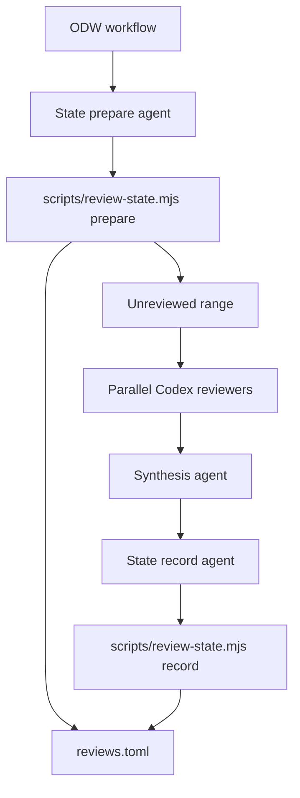

# Dakar incremental CodeRabbit review workflow design

Status: Draft implemented
Audience: Developers implementing and operating Dakar workflows
Date: 2026-06-29

## Problem

Dakar needs an Open Dynamic Workflow (ODW) that reviews only commits that have
not been reviewed before. The workflow must use a CodeRabbit YAML file as the
review policy source, fan out to several Codex reviewers, synthesize their
findings, and persist review history under an XDG state directory.

## Research summary

CodeRabbit documents `.coderabbit.yaml` as the repository-root configuration
surface for review behaviour, including `reviews.path_instructions`,
`reviews.pre_merge_checks`, tone, language, labels, and auto-review behaviour.
The example file in `examples/df12-code-review.yaml` uses those same surfaces.

The XDG Base Directory Specification defines `$XDG_STATE_HOME` for persistent
user-specific state and defaults it to `$HOME/.local/state` when unset. The
requested path uses `~/.local/data`; this design records the prompt path as a
compatibility note but implements the XDG-correct default at
`$XDG_STATE_HOME/dakar/<repo-owner>/<repo-name>/<branch-slug>/reviews.toml`.

SARIF 2.1.0 is the OASIS standard exchange format for static-analysis results.
Semgrep can emit JSON and SARIF, run diff-aware CI scans, and use baseline
commits. SCIP is a language-agnostic code-intelligence index format for code
navigation. Tree-sitter provides fast incremental syntax trees across many
languages. These tools inform future metrics and enrichment, but the initial
implementation avoids hard dependencies.

Sources:

- [CodeRabbit configuration reference](https://docs.coderabbit.ai/reference/configuration)
- [XDG Base Directory Specification](https://specifications.freedesktop.org/basedir/)
- [SARIF 2.1.0](https://docs.oasis-open.org/sarif/sarif/v2.1.0/sarif-v2.1.0.html)
- [Semgrep CLI reference](https://docs.semgrep.dev/cli-reference)
- [SCIP repository](https://github.com/scip-code/scip)
- [Tree-sitter introduction](https://tree-sitter.github.io/)

## Goals

The workflow must:

- Compute the unreviewed range as `last-reviewed-head..HEAD`, falling back to
  `merge-base(base, HEAD)..HEAD` when no review history exists.
- Skip when the current head has already been reviewed.
- Use CodeRabbit YAML as review policy input rather than inventing a separate
  policy format.
- Dispatch five Codex reviewers initially: `gpt-5.5` at low, medium, and high
  reasoning, `gpt-5.4-mini`, and `gpt-5.3-codex-spark`.
- Record one TOML review entry after synthesis, including commit range, model
  set, changed files, finding count, summary, and metrics JSON.
- Keep the deterministic range/history logic outside the ODW script because
  ODW v0.4 rejects workflow-level imports and `require`.

## Non-goals

The initial workflow does not post GitHub PR comments, enforce branch
protection, run static analysers automatically, validate the full CodeRabbit
schema, or prove model availability. ODW passes model identifiers to the Codex
adapter; adapter configuration owns availability.

## Architecture



Figure 1: The ODW script orchestrates agents. The Node helper owns deterministic
git and state-file operations.

## State model

The history file is a TOML document with repeated `[[reviews]]` entries. Dakar
parses completed entries by `head_commit`. A head is reusable only when
`git merge-base --is-ancestor <head_commit> HEAD` succeeds. This prevents a
review recorded on an unrelated branch from suppressing current work.

Example entry:

```toml
[[reviews]]
review_id = "abc123-1780000000000"
status = "completed"
started_at = ""
completed_at = "2026-06-29T17:57:30.000Z"
base_commit = "1111111111111111111111111111111111111111"
head_commit = "2222222222222222222222222222222222222222"
commit_count = 3
changed_files = ["src/lib.rs", "tests/lib.test.rs"]
models = ["gpt-5.5/low", "gpt-5.5/medium"]
findings_total = 2
summary = "Two blocking findings."
metrics_json = "{\"confirmedFindings\":2}"
```

## Workflow contract

`workflows/coderabbit-code-review.js` exposes `meta.name =
"coderabbit-code-review"` and accepts these args:

- `config`: CodeRabbit YAML path, default `examples/df12-code-review.yaml`.
- `base`: base ref for merge-base calculation, default `origin/main`.
- `head`: reviewed head ref, default `HEAD`.
- `stateRoot`: optional state root override for tests or compatibility runs.
- `models`: optional model list replacing the default five Codex reviewers.
- `synthesisModel`: model for prepare, synthesis, and record agents.
- `dryRun`: when true, returns configuration without calling agents.

The workflow returns the reviewed range, changed files, per-model review JSON,
synthesized findings, and recording result.

## Metrics

The initial metrics fit in the `metrics_json` field:

- `reviewerCount`, `candidateFindings`, `confirmedFindings`, and
  `duplicateFindingGroups` to evaluate ensemble behaviour.
- `diffStat`, `commitCount`, and `changedFiles.length` to normalize review
  density.
- Per-reviewer `filesInspected`, `findingsProposed`, and
  `falsePositiveRisks` to compare model roles over time.

Future static-analysis enrichment should ingest SARIF from tools such as
Semgrep and CodeQL, then record overlap between static findings and model
findings. Future codegraph enrichment should record whether SCIP, LSP, or
Tree-sitter context was available and whether it changed finding survival rate.

## Verification

The state helper is covered by Node tests that create temporary git
repositories and prove three behaviours:

- A branch with no review history reviews `merge-base..HEAD`.
- A later prepare call skips commits already recorded in `reviews.toml`.
- A prepare call at an already recorded head returns `alreadyReviewed = true`.

The ODW script has a `dryRun` mode so syntax and metadata can be checked without
launching review agents.

## Failure modes

If `origin/main` is unavailable, callers should pass `base`. If no recorded head
is an ancestor of `HEAD`, the helper warns and uses the merge base. If a record
agent fails after synthesis, the returned review remains available in the ODW
result but the next run may review the same commits again.

## Editing pass notes

The document keeps implementation defaults out of the design except where they
define a contract: the TOML state format, ODW args, model set, and verification
properties. Broader static-analysis and codegraph integration remains future
work because it requires tool availability decisions not present in the initial
repository.
