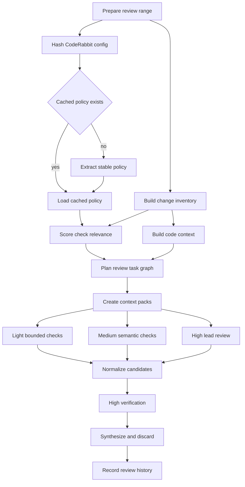
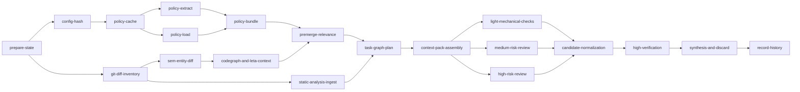

# Dakar incremental CodeRabbit review workflow design

Status: First routed workflow pass implemented
Audience: Developers implementing and operating Dakar workflows
Date: 2026-06-29

## Problem

Dakar needs an Open Dynamic Workflow (ODW) that reviews only commits that have
not been reviewed before. The workflow must use a CodeRabbit YAML file as the
review policy source, divide review work across Codex agents by risk and task
shape, synthesize their findings, discard weak findings with an audit trail,
and persist review history under an XDG state directory.

## Research summary

CodeRabbit documents `.coderabbit.yaml` as the repository-root configuration
surface for review behaviour, including `reviews.path_instructions`,
`reviews.pre_merge_checks`, `reviews.tools`, labels, knowledge-base settings,
and auto-incremental review behaviour. The configuration also distinguishes
stable policy from run-specific PR facts: path instructions and pre-merge check
definitions are stable until the YAML changes, while relevance, difficulty, and
severity depend on the changed files and semantic diff.

The XDG Base Directory Specification defines `$XDG_STATE_HOME` for persistent
user-specific state and defaults it to `$HOME/.local/state` when unset. The
requested path uses `~/.local/data`; this design records the prompt path as a
compatibility note but implements the XDG-correct default at
`$XDG_STATE_HOME/dakar/<repo-owner>/<repo-name>/<branch-slug>/reviews.toml`.

AgentGroupChat-V2 argues for hierarchical task forests, dependency-aware
parallel execution, heterogeneous model assignment, and specialized roles. Its
ablation results are directly relevant here: homogeneous agents become
redundant as the number of agents increases, while specialized role division
improves with more agents and moderate interaction depth. The production review
workflow therefore replaces equal full-diff fan-out with a task graph: a heavy
lead reviewer owns semantic judgement, and smaller agents handle bounded
extraction and mechanical checks.

AutoGen separates single-agent, multi-agent, and event-driven agent
orchestration, including MCP-backed tools and distributed runtimes. That
supports the same boundary this design uses: deterministic preparation and
tool output first, agent reasoning second, final arbitration last.

SARIF 2.1.0 is the OASIS standard exchange format for static-analysis results.
Static analysis findings should enter the review as candidate facts, not final
review decisions. Light agents may cluster and summarize SARIF results; the
lead reviewer verifies blocking findings.

`sem` is useful before fan-out because it produces entity-level diffs from git
ranges. It identifies changed functions, types, structured-data entries, and
Markdown sections, which is a better dispatch unit than raw file paths.

`leta` is useful for LSP-backed lookup, references, implementations, and call
hierarchies when a changed symbol is known. It should prime agents with precise
symbol navigation commands rather than asking them to grep blindly.

`ops-codegraph-tool` can add a local function-level dependency graph across 34
languages, an MCP server, diff-impact analysis, complexity metrics, code-owner
mapping, co-change analysis, boundary checks, and batch querying. It is not a
replacement for reviewer judgement, but it is a strong source for ownership
clusters, blast-radius estimates, and bounded review tasks.

OpenAI prompt caching rewards stable prompt prefixes. Static content such as
workflow instructions, task schemas, cached CodeRabbit policy, and tool-use
rules should appear before dynamic per-run content such as the commit range,
changed snippets, and candidate findings.

Recent code-review and software-engineering research supports a narrower
claim than "more agents are better". The useful pattern is: bound the task,
provide precise context, generate candidate findings cheaply, and put a strong
critic in charge of refutation and final synthesis. The design therefore treats
heterogeneous fan-out as a way to cover scoped work, not as a vote over five
full-diff reviews.

Evidence from the user-provided Elicit scan, checked with Firecrawl, maps to
the workflow as follows:

- Saleem et al.'s 2026 Agentic Code Review paper reports that a
  meta-cognitive critic reduced false positives by 40%, improved line-number
  accuracy from 67% to 92%, and lowered hallucination rate from 32% to 18% on
  vulnerable Python samples. Dakar should therefore make `gpt-5.5` high the
  verifier and synthesizer, not merely one proposer among peers.
- SWR-Bench introduces 1,000 manually verified pull requests with full project
  context, an objective evaluator with about 90% human agreement, and a simple
  multi-review aggregation strategy that improves F1 by up to 43.67%. Dakar
  should aggregate normalized candidates after context-bounded review, rather
  than fan the whole diff to redundant reviewers.
- Cihan et al. found GPT-4o and Gemini 2.0 Flash classified code correctness
  only 68.50% and 63.89% of the time with problem descriptions, with weaker
  performance when descriptions were omitted. Dakar should treat raw LLM
  review output as untrusted until verified against source, diff, policy, and
  available runtime or static evidence.
- LLM4FPM, ZeroFalse, and SemTaint all support static-analysis hybrids:
  extract precise code context, treat analyzer output as structured contracts
  or taint specs, and ask LLMs to adjudicate gaps that static analysis cannot
  resolve. Dakar should ingest SARIF, CodeQL, Semgrep, `sem`, `leta`, and
  codegraph outputs as evidence and routing inputs, not as final findings.
- Hanam et al. show semantic change impact analysis can reduce false positives
  and shrink impact sets compared with syntactic diffs; their user study found
  stronger semantics helped reviewers find defects. Dakar should route by
  changed entities and dependency neighbourhoods before splitting by file
  count.
- Runtime-Structured Task Decomposition shows that static decomposition can be
  worse than monolithic prompting when failures force downstream reruns, while
  runtime-structured control logic reruns only failed subtasks. Dakar should
  keep task dependencies and retry state in executable workflow data, not in
  prompt prose alone.
- SE-Jury supports ensemble judging for software-engineering artefacts, but as
  structured independent judges plus explicit scoring. Dakar should use
  independent refutation schemas and deterministic reductions, not open-ended
  debate transcripts.
- Tufano et al.'s controlled study warns that automated reviews can anchor
  reviewer attention, increasing low-severity findings without improving
  high-severity discovery, review time, or confidence. Dakar should cap
  findings, allow `not_applicable`, record discarded candidates, and require
  the synthesizer to actively throw away weak role-specific outputs.

Sources:

- [CodeRabbit configuration reference](https://docs.coderabbit.ai/reference/configuration)
- [XDG Base Directory Specification](https://specifications.freedesktop.org/basedir/)
- [AgentGroupChat-V2](https://arxiv.org/html/2506.15451v1)
- [AutoGen documentation](https://microsoft.github.io/autogen/stable//index.html)
- [SARIF 2.1.0](https://docs.oasis-open.org/sarif/sarif/v2.1.0/sarif-v2.1.0.html)
- [ops-codegraph-tool](https://github.com/optave/ops-codegraph-tool)
- [ops-codegraph-tool AI agent guide](https://raw.githubusercontent.com/optave/ops-codegraph-tool/main/docs/guides/ai-agent-guide.md)
- [OpenAI prompt caching](https://developers.openai.com/api/docs/guides/prompt-caching)
- [Agentic Code Review](https://www.semanticscholar.org/paper/b3c711a5b7583853784ced9a5ea4ad20ef2811b9)
- [SWR-Bench](https://www.semanticscholar.org/paper/2affab64adb964bef66df6e99be3db601b8256ff)
- [Evaluating Large Language Models for Code Review](https://arxiv.org/abs/2505.20206)
- [Runtime-Structured Task Decomposition](https://www.semanticscholar.org/paper/a3e5974206faef2d75679a2a4ded4cd3d3c099a6)
- [LLM4FPM](https://arxiv.org/abs/2411.03079)
- [SemTaint](https://arxiv.org/abs/2601.10865)
- [ZeroFalse](https://arxiv.org/abs/2510.02534)
- [SE-Jury](https://arxiv.org/abs/2505.20854)
- [Semantic Change Impact Analysis](https://www.semanticscholar.org/paper/eaa00eb02dc86938a3a410f03fc4fb8fbb3134f1)
- [Deep Learning-based Code Reviews](https://www.semanticscholar.org/paper/6b3c09a1be7120784ec8dc7a70bf185e60bc60f3)

## Goals

The workflow must:

- Compute the unreviewed range as `last-reviewed-head..HEAD`, falling back to
  `merge-base(base, HEAD)..HEAD` when no review history exists.
- Skip when the current head has already been reviewed.
- Use CodeRabbit YAML as review policy input rather than inventing a separate
  policy format.
- Cache stable CodeRabbit policy extraction under a deterministic config hash.
- Recompute run-specific relevance and difficulty for each pre-merge check.
- Dispatch review work by bounded task, risk, and required judgement rather
  than sending every agent the same full diff.
- Use `gpt-5.5` high as lead reviewer and final verifier.
- Use `gpt-5.5` medium for medium-risk semantic review and challenge passes.
- Use `gpt-5.4-mini` and `gpt-5.3-codex-spark` for bounded extraction,
  clustering, inventory, and mechanical checks.
- Record one TOML review entry after synthesis, including commit range, task
  assignments, confirmed findings, discarded findings, summary, and metrics
  JSON.
- Keep deterministic range/history logic outside the ODW script because ODW
  v0.4 rejects workflow-level imports and `require`.

## Non-goals

The initial workflow does not post GitHub PR comments, enforce branch
protection, validate the full CodeRabbit schema, prove model availability, or
trust light agents to judge substantive proofs. ODW passes model identifiers to
the Codex adapter; adapter configuration owns availability.

## Architecture

The workflow is a routed task forest. Nodes above the fan-out boundary produce
stable inputs for all agents. Nodes below it are bounded review tasks. The lead
reviewer verifies candidate findings before synthesis records the review.



Figure 1: The workflow separates cached policy extraction from per-run
relevance scoring. Only verified findings reach the final report.

## Dependency graph

The task graph below names the review tasks and their dependencies. Tasks with
the same predecessor can run in parallel after the predecessor completes.



Figure 2: Deterministic inventory and cached policy tasks precede model
fan-out. Verification and synthesis are serial because they decide what the
workflow records as review history.

## Cached policy and per-run relevance

Dakar stores cached CodeRabbit policy analysis by deterministic hash:

```plaintext
$XDG_STATE_HOME/dakar/<repo-owner>/<repo-name>/config-cache/
  <sha256-config-bytes>-<policy-analyser-version>.json
```

The cache key is the SHA-256 digest of the exact YAML bytes plus the policy
analyser version. Using bytes rather than a semantic YAML hash makes the first
implementation deterministic without depending on a complete CodeRabbit schema
parser. A later implementation may add a canonical semantic hash if it needs to
ignore comments or formatting-only edits.

The cached policy bundle contains stable facts:

- review language, tone, profile, and auto-review settings
- `path_filters`
- `path_instructions`
- enabled tools and tool configuration
- `pre_merge_checks` definitions and enforcement modes
- review labels, reviewer instructions, and knowledge-base file patterns
- policy extraction warnings

The per-run relevance overlay is never cached by config hash alone. It depends
on `reviewBase..headCommit`, changed files, entity diffs, static-analysis
results, and codegraph impact:

- whether a pre-merge check touches changed files
- whether the check can be evaluated mechanically
- likely severity if the check fails
- required agent capability
- whether `gpt-5.5` high must verify the result

## Behaviour specification

`prepare-state`

: Run `scripts/review-state.mjs prepare`, compute the unreviewed range,
  changed files, commit count, and state-file path. Skip when `HEAD` is already
  reviewed. Use the deterministic helper through `gpt-5.5` high or a local
  command wrapper. Tools: `git`, `scripts/review-state.mjs`, and XDG state
  rules.

`config-hash`

: Read the CodeRabbit YAML bytes and compute the config cache key. Do not
  interpret relevance here. Use a local helper or `gpt-5.3-codex-spark` if the
  step is agentized. Tools: SHA-256 and the config path from workflow args.

`policy-cache`

: Load a cached policy bundle when the hash and analyser version match;
  otherwise request extraction. Use a local helper. Tools: XDG state and JSON
  schema validation.

`policy-extract`

: Parse stable CodeRabbit policy into normalized fields: path instructions,
  path filters, tools, pre-merge checks, labels, and review tone. Use
  `gpt-5.4-mini` for extraction; `gpt-5.5` high verifies parser warnings during
  rollout. Tools: CodeRabbit docs, YAML parser, and structured output schema.
  Cache only this stable policy bundle by config hash; do not cache per-run
  relevance or difficulty.

`git-diff-inventory`

: Produce file-level diff stats and classify paths as source, test, docs,
  config, generated, dependency, or unknown. Use `gpt-5.3-codex-spark`. Tools:
  `git diff --name-status` and `git diff --stat`.

`sem-entity-diff`

: Convert changed files into entity-level changes. Prefer functions, methods,
  types, modules, Markdown sections, and YAML/TOML keys over raw line ranges.
  Use a local helper, with a light agent summarizing output. Tool:
  `sem diff --from <base> --to <head> --format json`.

`static-analysis-ingest`

: Ingest SARIF or tool-native JSON, group findings by rule and changed entity,
  and mark whether each finding intersects the review range. Use
  `gpt-5.4-mini`. Treat each warning as a structured contract containing rule,
  location, trace, CWE or category when available, and changed-range
  intersection. Tools: SARIF, Semgrep, CodeQL, and project linters.

`codegraph-and-leta-context`

: Build ownership clusters and blast-radius summaries for changed entities. Use
  codegraph when available; use Leta for precise LSP refs and calls; fall back
  to git and `sem`. Use local tools plus a `gpt-5.3-codex-spark` summary.
  Tools: `codegraph diff-impact`, `codegraph owners`, `codegraph triage`,
  `leta refs`, `leta calls`, and `leta show`.

`premerge-relevance`

: Score each pre-merge check for applicability, difficulty, mechanical
  evaluability, and required verifier. `gpt-5.5` medium drafts; `gpt-5.5` high
  approves. Inputs: cached policy bundle, entity diff, and static-analysis
  clusters. Recompute this every run because changed entities alter whether a
  stable pre-merge check is relevant.

`task-graph-plan`

: Create bounded review tasks with `taskId`, files, entities, policy source,
  max findings, model assignment, dependencies, and verification policy. Use
  `gpt-5.5` high. Tools: ODW planning, CodeRabbit policy, and codegraph/sem
  context.

`context-pack-assembly`

: Create one stable context pack per task class and one small dynamic tail per
  task. Include only files, entities, and policy snippets needed for the task.
  Use a local helper or `gpt-5.4-mini`. Tools: `context_pack`, `sem`, `leta`,
  codegraph, and git snippets.

`light-mechanical-checks`

: Execute bounded checks: docs links, changelog consistency, title/description
  requirements, path-instruction presence, static-analysis clustering, and
  obvious missing-test inventory. Return candidates, not conclusions. Use
  `gpt-5.4-mini` or `gpt-5.3-codex-spark`. The prompt must make
  `no_findings` and `not_applicable` first-class valid outputs. Tools:
  `markdownlint`, SARIF, CodeRabbit pre-merge checks, and path globs.

`medium-risk-review`

: Review medium-risk clusters where local reasoning is required but global
  invariants are unlikely: test/code consistency, config behaviour, API
  documentation drift, and moderate blast-radius changes. Use `gpt-5.5`
  medium. Inputs: context pack, `sem`, `leta`, and codegraph summaries.

`high-risk-review`

: Review correctness, security, concurrency, migrations, state machines, public
  API compatibility, proof quality, property tests, and high-blast-radius
  entities. Use `gpt-5.5` high. Inputs: full context pack, `leta
  show/refs/calls`, codegraph impact, and static-analysis evidence.

`candidate-normalization`

: Convert all agent outputs and tool findings into one candidate schema with
  source task, evidence, confidence, changed-range link, and required verifier.
  Use `gpt-5.4-mini`. Do not improve or argue the finding here; normalize,
  de-duplicate, and preserve evidence. Tools: structured output schema and
  dedupe keys.

`high-verification`

: Verify every candidate that could block merge, every light-agent candidate
  above low severity, and every proof/test-substance claim. Reject speculative
  or irrelevant findings. Use `gpt-5.5` high. Inputs: git diff, source
  excerpts, test/proof files, and static-analysis traces. This is an
  adversarial refutation step: the verifier tries to kill each candidate before
  promoting it.

`synthesis-and-discard`

: Deduplicate accepted findings, downgrade severity when warranted, and record
  discarded findings with reason codes. Produce the final review report and
  metrics. Use `gpt-5.5` high. Inputs: candidate schema, verification results,
  and audit log.

`record-history`

: Append the review record to `reviews.toml` only after synthesis finishes.
  Include task metrics and discarded-finding counts. Use the deterministic
  helper through `gpt-5.5` high or a local command wrapper. Tools:
  `scripts/review-state.mjs record` and TOML writer.

## Agent assignment policy

`gpt-5.5` high is the lead reviewer. It owns the final task graph, semantic
review for high-risk clusters, verification, synthesis, and discard decisions.
It must judge proof well-formedness, property-test substance, security impact,
state-machine invariants, migration safety, and cross-file correctness.

`gpt-5.5` medium handles medium-risk review tasks and drafts relevance scores.
It can challenge the lead reviewer on a bounded finding, but it does not
override high on blocking findings.

`gpt-5.4-mini` handles structured extraction, policy parsing, static-analysis
clustering, docs checks, changelog checks, simple test inventory, and candidate
normalization.

`gpt-5.3-codex-spark` handles fastest inventory work: changed-file summaries,
path classification, obvious missing artefacts, TODO/FIXME extraction, and
small mechanical checks. It should not classify proof quality or decide whether
a semantic code finding blocks merge.

The default pattern is fast finder, heavy verifier. The inverse pattern,
heavy finder with light presentation check, is allowed only when the light
agent checks schema completeness rather than truth.

The fan-out strategy is therefore:

- Use `gpt-5.3-codex-spark` for inventory tasks that are cheap to verify:
  changed files, path classes, generated-file detection, and missing artefact
  lists.
- Use `gpt-5.4-mini` for bounded extraction and clustering: CodeRabbit policy
  normalization, SARIF grouping, docs/config checks, and candidate schema
  repair.
- Use `gpt-5.5` medium for focused semantic proposal and challenge passes when
  the changed cluster is coherent and does not require proof, security, or
  global invariant judgement.
- Use `gpt-5.5` high for high-risk finding, all proof/security/state-machine
  judgement, adversarial verification, final synthesis, and auditable discard.

This strategy intentionally avoids homogeneous full-diff fan-out. When multiple
agents inspect the same surface, they must inspect it from distinct bounded
roles, such as "find likely invariant breaks", "try to refute these
candidates", or "cluster static-analysis traces". They do not all produce
parallel final reviews.

## ODW realization constraints

The ODW script implements the dependency graph as executable JavaScript data:
task objects with `taskId`, `dependsOn`, `kind`, `assignedModel`,
`contextPack`, `maxFindings`, `schema`, and `verificationPolicy`. It should not
hide the graph inside a monolithic prompt.

Current ODW realities shape the implementation:

- The workflow file must use a literal `meta` export, injected primitives, and
  no workflow-level imports.
- Deterministic filesystem and git work stay in local helpers or host-invoked
  commands because ODW agent calls do not share a reliable mutable filesystem
  in copy mode.
- Live runs accept `repoRoot` so copied agent workspaces can inspect the real
  git checkout with `git -C <repoRoot>`. This keeps the workflow compatible
  with ODW copy isolation, where the copied workspace may not include `.git`.
- `odw.config.json` defines `codex-low`, `codex-medium`, and `codex-high`
  adapters because the built-in Codex adapter forwards `model` but has no
  separate reasoning-effort flag. Workflow tasks select the adapter for
  reasoning effort and pass the plain model id through `model`.
- Agent handoffs use JSON Schemas. Downstream workflow JavaScript must consume
  structured fields rather than parse prose.
- Independent finder tasks run with `parallel()` once context packs are ready.
- Candidate verification uses `pipeline()` so each candidate can move through
  refutation independently.
- `parallel()` and `pipeline()` results are filtered for failed or null slots.
  Reduction is order-independent: dedupe by key, tally refutations, and sort by
  severity and source location.
- Retry-only-failed-subtask behaviour is represented as explicit task status
  records and bounded retry rounds. The initial workflow can rerun failed leaf
  tasks in a controlled loop, but it cannot depend on a separate dynamic DAG
  scheduler or shared per-agent files.
- Fan-out is bounded by args such as `maxTasks`, `maxCandidates`,
  `maxRefuters`, and by `budget.remaining()` when ODW exposes budget
  estimates.
- ODW does not commit, push, apply patches, or update repository state by
  itself. The only persistent write in this design is the deterministic review
  history record after synthesis.

The candidate and verdict schemas should include enough fields for audit:

- candidate: `candidateId`, `taskId`, `title`, `severity`, `path`, `line`,
  `changedRange`, `evidence`, `sourceKind`, `policyRefs`, `toolTraceRefs`, and
  `confidence`.
- verdict: `candidateId`, `status`, `refutationReason`, `acceptedSeverity`,
  `requiredHumanReview`, `evidenceChecked`, and `notes`.

ODW prompts should be built from stable prefix blocks first and dynamic
per-task tails last. This matches prompt-cache guidance and also keeps smaller
agents from receiving broad context they cannot use.

## Scoping bounded tasks

Each fan-out task must include a hard boundary:

- changed files and entity IDs
- relevant CodeRabbit policy snippets
- maximum source excerpts
- maximum findings
- allowed tools
- explicit non-goals
- output schema
- verification policy

A bounded task may return no findings. The prompt must say this directly. For
example, a task looking for applications of `trybuild` tests must report
`not_applicable` when the change has no compile-fail surface. It must not
invent a test need because its assigned role is test-focused.

The planner uses these scoping rules:

- Give light agents one policy check or one path cluster at a time.
- Give medium agents one cohesive ownership cluster or one medium-risk
  pre-merge check.
- Give high one high-risk cluster plus its impact neighbourhood.
- Split tasks by entity and dependency neighbourhood before splitting by file
  count.
- Escalate any task whose output would require proof, security, or cross-file
  invariant judgement.

## Context priming and prefix caching

The orchestrator should build prompts in this order:

1. Static workflow identity and role rules.
2. Static task output schema.
3. Cached CodeRabbit policy bundle for the config hash.
4. Stable tool-use instructions for `sem`, `leta`, codegraph, and
   `context_pack`.
5. Task-class examples, if any.
6. Dynamic run data: commit range, changed entities, source excerpts, and
   candidate findings.

This order maximizes prompt-cache reuse because the longest common prefix
stays unchanged across tasks that share the same workflow version and
CodeRabbit config hash. The OpenAI prompt caching guide states that cache hits
require exact prefix matches and recommends placing static content before
dynamic content.

Use `prompt_cache_key` at task-class granularity, for example:

```plaintext
dakar-review:<repo-owner>/<repo-name>:<config-hash>:<workflow-version>:<task-kind>
```

This keeps related requests on the same cache route without forcing unrelated
task kinds to share one key. The workflow should record `cached_tokens`,
latency, and model for each agent call when the adapter exposes usage data.

`context_pack` should create stable packs for repeated context:

- `policy-pack`: normalized CodeRabbit policy for the config hash
- `review-contract-pack`: output schemas, severity rules, discard rules
- `tooling-pack`: allowed commands for `sem`, `leta`, codegraph, and SARIF
- `cluster-pack`: source excerpts and graph summaries for one task cluster

The first three packs are shared across tasks and should appear before the
dynamic cluster pack. Pack sections and references must be sorted
deterministically by key and path. Source excerpts belong in the dynamic tail
unless the same excerpt is intentionally reused across many tasks.

## Static analysis and codegraph strategy

Static analysis is an evidence source. SARIF results become candidate findings
with rule ID, location, message, and changed-range intersection. Light agents
may cluster the results and remove duplicates from the same rule/location
pair, but high verifies all blocking candidates.

`sem` should run for every review range when installed:

```bash
sem diff --from <review-base> --to <head> --format json
```

The planner uses the JSON to dispatch by changed entity. For example, a change
to one exported function with many callers becomes a high-risk semantic task;
a Markdown heading change becomes a docs task unless CodeRabbit policy says
otherwise.

`leta` should be used when the task names a symbol and the language server can
answer references or calls:

```bash
leta refs <symbol>
leta calls --from <symbol>
leta calls --to <symbol>
leta show <symbol>
```

The output primes the reviewing agent with exact navigation targets and reduces
raw file reads.

`ops-codegraph-tool` should be optional but preferred for larger repositories:

```bash
codegraph build .
codegraph diff-impact <review-base> -T --json
codegraph owners <target> -T --json
codegraph triage -T --limit 20 --json
codegraph check --staged --no-new-cycles
```

Dakar should record whether codegraph was available, graph quality if exposed,
changed functions, affected callers, affected files, ownership boundaries,
complexity deltas, and cycle or boundary violations. These fields make later
evaluation possible: the team can compare finding survival rate with and
without graph context.

## Synthesis and discard policy

Synthesis is not a merge operation over agent opinions. It is an adjudication
step. The synthesizer must be willing to discard findings.

Every candidate finding receives one final status:

- `accepted`: the finding is supported by changed-range evidence and remains
  actionable.
- `duplicate`: another accepted finding covers the same issue.
- `out_of_scope`: the issue is outside `reviewBase..HEAD`.
- `not_applicable`: the assigned check does not apply to this change.
- `insufficient_evidence`: the candidate lacks file, line, trace, reproduction,
  or source evidence.
- `speculative`: the candidate depends on an unstated runtime or user behaviour
  assumption.
- `tool_false_positive`: a static-analysis result is explained by context.
- `severity_downgraded`: the issue is real but lower impact than proposed.
- `needs_human`: the workflow cannot decide from available context.

The final report includes only `accepted` findings. The review record includes
discard counts by reason and may include full discarded candidates when the
state file size budget allows. This audit trail prevents narrow agents from
turning role-specific pressure into low-quality findings.

## State model

The history file is a TOML document with repeated `[[reviews]]` entries. Dakar
parses completed entries by `head_commit`. A head is reusable only when
`git merge-base --is-ancestor <head_commit> HEAD` succeeds. This prevents a
review recorded on an unrelated branch from suppressing current work.

Example entry:

```toml
[[reviews]]
review_id = "abc123-1780000000000"
status = "completed"
started_at = ""
completed_at = "2026-06-29T17:57:30.000Z"
base_commit = "1111111111111111111111111111111111111111"
head_commit = "2222222222222222222222222222222222222222"
commit_count = 3
changed_files = ["src/lib.rs", "tests/lib.test.rs"]
models = ["gpt-5.5/high", "gpt-5.4-mini/medium"]
findings_total = 2
summary = "Two blocking findings."
metrics_json = "{\"confirmedFindings\":2,\"discardedFindings\":5}"
```

## Workflow contract

`workflows/coderabbit-code-review.js` exposes `meta.name =
"coderabbit-code-review"` and accepts these args in the first routed
implementation:

- `config`: explicit CodeRabbit YAML path. When omitted, Dakar resolves
  repository-local `.coderabbit.yaml`, `.coderabbit.yml`, `coderabbit.yaml`, or
  `coderabbit.yml`; then `$XDG_CONFIG_HOME/dakar/config.yaml` or
  `~/.config/dakar/config.yaml`; then the bundled example config.
- `repoRoot`: real git checkout path used by the prepare helper and diff
  prompts, default `.`. Live runs should pass an absolute path because ODW
  copy workspaces may not contain `.git`.
- `base`: base ref for merge-base calculation, default `origin/main`.
- `head`: reviewed head ref, default `HEAD`.
- `stateRoot`: optional state root override for tests or compatibility runs.
- `maxTasks`: cap on planned review tasks, default `8`.
- `maxCandidates`: cap on normalized candidate findings before verification,
  default `30`.
- `maxFindings`: cap on accepted final findings, default `20`.
- `models`: optional model list replacing the default Codex agent set.
- `synthesisModel`: model for prepare, high verification, synthesis, and
  record agents, default `gpt-5.5`.
- `synthesisReasoning`: reasoning suffix for the synthesis model when
  `synthesisModel` does not already include one, default `high`.
- `dryRun`: when true, returns configuration, task kinds, default task graph,
  limits, and JSON Schemas without calling agents.

The implemented routed phases are:

1. `Prepare`: ask a Codex agent to run `scripts/review-state.mjs prepare`.
2. `Plan`: build deterministic task objects in workflow JavaScript from the
   prepared changed-file list.
3. `Review`: run task prompts with `parallel()`.
4. `Verify`: run accepted candidates through a `pipeline()` of `gpt-5.5` high
   verifier prompts.
5. `Synthesize`: produce `reportMarkdown`, machine-readable accepted findings,
   and metrics.
6. `Record`: ask a Codex agent to run `scripts/review-state.mjs record`.

The first routed planner classifies changed files into `source`, `tests`,
`config`, `docs`, or `unknown`. Dependency lockfiles and unknown paths route
through source review because they can affect runtime behaviour. The planner
adds a `review-summary` task so the workflow always has one cross-cutting pass
over the change set.

Dry-run output is a contract preview. It includes:

- `workflowVersion`, currently `divide-and-conquer-v1`
- `repoRoot`
- `synthesisModel`, currently `gpt-5.5/high` by default
- `synthesisAdapter`, currently `codex-high` by default
- `taskKinds`
- `limits`
- `defaultTaskGraph`
- `candidateSchema`
- `verdictSchema`
- `synthesisSchema`

Live output includes:

- `config`
- `resolvedConfig`
- `taskGraph`
- `taskResults`
- `candidates`
- `verdicts`
- `findings`
- `discarded`
- `reportMarkdown`
- `metrics`
- `recorded`

The next implementation revision should add these args:

- `policyCacheRoot`: optional cache root for config-hash policy bundles.
- `sarif`: optional list of SARIF files to ingest.
- `maxDiscardLogEntries`: cap for recording full discarded candidates.
- `enableSem`: use `sem diff` to route by changed entities instead of file
  class alone.
- `enableLeta`: include language-server reference and call context.
- `enableCodegraph`: include codegraph impact and ownership context.

The workflow returns the reviewed range, changed files, task graph, per-task
agent results, synthesized findings, discarded-finding summary, and recording
result.

## CLI contract

`bin/dakar-review.mjs` is the globally installable wrapper exposed as
`dakar-review` through `package.json`. It is designed for `bun install -g "$PWD"`
from a Dakar checkout and for agent-to-agent automation.

The CLI runs the workflow from Dakar's package root, passes that package root
as ODW `--source`, and passes the reviewed checkout as workflow `repoRoot`.
This keeps Dakar's workflow, helper scripts, and `odw.config.json` available
after global installation while still reviewing the target repository's git
range.

The CLI and workflow share `scripts/review-config.mjs` for config resolution.
This makes user-level `~/.config/dakar/config.yaml` behave as the current
repository's CodeRabbit YAML only when the repository does not provide its own.

The default output format is exactly one JSON object on standard output. The
object is the workflow return value, without ODW's `running ...` progress line.
`--format markdown` prints `reportMarkdown` when present, but JSON remains the
stable machine interface.

`--telemetry` is an opt-in supervision path for interactive agents. Instead of
using `odw run --wait`, the CLI starts the ODW run in the background, extracts
the run id, follows `odw logs <run-id> --follow`, and then fetches
`odw result <run-id>`. All telemetry is written to standard error. This keeps
the normal result stream deterministic while giving long-running agent reviews
visible progress.

`reportMarkdown` is intentionally presentation text. It is constrained by the
synthesis prompt but does not have a deterministic schema or template in the
current workflow. Machine consumers must use structured fields such as
`findings`, `discarded`, `metrics`, `verdicts`, and `recorded`.

Exit status is transport-oriented:

- Exit `0` when the workflow completed, including when accepted findings exist.
- Exit non-zero when CLI parsing, ODW execution, or the workflow itself returns
  `ok: false`.
- On CLI or ODW process failures before a workflow object exists, print a JSON
  error object to standard error with `ok: false`, `stage`, and `error`.

## Metrics

The initial metrics fit in the `metrics_json` field:

- `taskCount`, `taskType`, `assignedModel`, `candidateFindings`,
  `confirmedFindings`, `discardedFindings`, and `discardReasonCounts`
- `verificationSurvivalRate` by task type and model
- `refutationRate`, `acceptedAfterRefutation`, and `killedByVerifier`
- `duplicateFindingGroups` and cross-agent duplicate rate
- `lineAccuracyAccepted` and `lineAccuracyRejected` when exact line checks are
  possible
- `hallucinationProxyCount` for candidates whose referenced file, symbol, or
  line cannot be matched
- `diffStat`, `commitCount`, `changedFiles.length`, changed entity count, and
  changed public API count
- `staticFindings`, `staticFindingsIntersectingDiff`, and
  `staticFindingsAccepted`
- `staticContractSurvivalRate` by rule, tool, CWE, and task type
- `premergeChecksRelevant`, `premergeChecksNotApplicable`, and
  `premergeChecksEscalatedToHigh`
- `semanticImpactSetSize`, `semanticImpactShrinkage`, and fallback mode when
  semantic tools are unavailable
- codegraph availability, graph quality, changed functions, affected callers,
  affected files, new cycles, complexity threshold failures, and owner
  boundary crossings
- `contextPackBytes`, source excerpt count, cached policy hash, cached token
  count, latency, and model
- high-verification time per accepted finding
- `retryRounds`, failed leaf tasks, retried leaf tasks, and estimated retry
  tokens avoided compared with rerunning all downstream tasks
- `noFindingTaskRate`, `notApplicableTaskRate`, and low-severity discard rate
- findings later overturned by humans, when feedback is available

These metrics support long-term evaluation of whether light agents are useful
finders, which task types survive high verification, and whether static
analysis or graph context improves confirmed-finding density. They also
measure whether the workflow is producing useful signal or merely dents from
role pressure.

## Verification

The state helper is covered by Node tests that create temporary git
repositories and prove three behaviours:

- A branch with no review history reviews `merge-base..HEAD`.
- A later prepare call skips commits already recorded in `reviews.toml`.
- A prepare call at an already recorded head returns `alreadyReviewed = true`.

The next implementation revision must add dry-run checks for:

- stable config hash calculation
- cache hit and cache miss behaviour
- prompt pack ordering for prefix-cache stability

The ODW script has a `dryRun` mode so syntax and metadata can be checked
without launching review agents. The routed dry-run contract is covered by
`tests/workflow-dry-run.test.mjs`; state-range behaviour is covered by
`tests/review-state.test.mjs`.

## Failure modes

If `origin/main` is unavailable, callers should pass `base`. If no recorded
head is an ancestor of `HEAD`, the helper warns and uses the merge base. If a
record agent fails after synthesis, the returned review remains available in
the ODW result but the next run may review the same commits again.

If CodeRabbit policy extraction fails, the workflow should continue with the
raw YAML and mark policy cache status as `failed`. If `sem`, `leta`, codegraph,
or SARIF inputs are unavailable, the planner records the missing tool and falls
back to git diff plus source excerpts. Missing graph tooling must not suppress
review.

If light agents emit many weak candidates, high verification rejects them with
auditable reasons and the metrics should lower future confidence for that task
type and assignment.

If automated review output begins anchoring synthesis on low-severity,
role-specific comments, the max-finding cap and verification prompt must be
tightened. A task that cannot prove relevance should return `no_findings` or
`not_applicable`.

If static or semantic context is incomplete, the final report must say which
tools were missing or degraded. Missing context lowers confidence; it does not
justify inventing a broader claim.

## Editing pass notes

The document now treats divide-and-conquer as the production path and equal
full-diff fan-out as an evaluation mode only. The design keeps implementation
defaults out of the design except where they define contracts: state format,
policy cache key, task graph, agent assignments, discard reasons, metrics, and
verification properties.

The 2026-06-29 research synthesis adds a stricter routed-review principle:
light agents propose or normalize bounded candidates, `gpt-5.5` high refutes
and synthesizes, and every discarded finding remains auditable. The ODW design
uses explicit task objects, JSON Schema handoffs, `parallel()` for independent
finder work, and `pipeline()` for per-candidate verification to match current
ODW authoring constraints.

The first implemented routed pass records a further decision: the task graph is
deterministic workflow JavaScript, while semantic judgement remains in agents.
This keeps dry-run and unit tests meaningful without pretending that file-class
routing is a complete semantic code graph. The design can evolve to `sem`,
`leta`, and codegraph-backed routing without changing the user-facing ODW
entrypoint.
