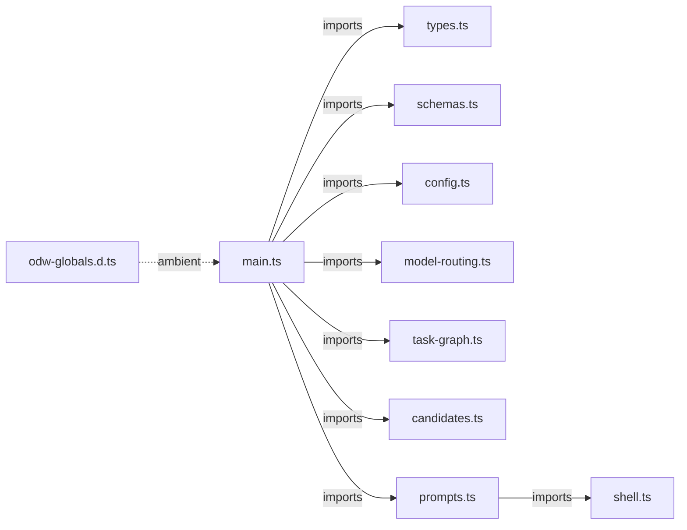

# Compile the Dakar review workflow from typed modules

This ExecPlan is a living document. The sections `Constraints`, `Tolerances`,
`Risks`, `Progress`, `Surprises & discoveries`, `Decision log`, and
`Outcomes & retrospective` must remain current as implementation proceeds.

Status: IN PROGRESS

## Purpose / big picture

Dakar currently ships a valid but 966-line Open Dynamic Workflows (ODW) script
at `workflows/dakar-review.js`. After this plan is complete, contributors will
edit small, strict TypeScript modules under `src/workflows/dakar-review/`, run
one deterministic build, and commit the regenerated workflow artefact. Users
will continue running `dakar-review` or
`odw run workflows/dakar-review.js`; commands, output, routing, state, and
record recovery will not change.

Success is observable at three levels. Pure planning, candidate, routing, and
prompt behaviour has direct module tests. The compiler rejects invalid ODW
artefacts and a freshness gate rejects stale generated output. The existing
ODW dry run, CLI suites, and one isolated live review prove that the installed
entrypoint still prepares, reviews, verifies, synthesizes, records, and skips a
head already present in review history.

This plan implements the proposed decision in
`docs/adr-001-compile-odw-workflow-from-typescript.md`. Obtain explicit approval
of this ExecPlan before beginning implementation. Record that approval by
changing ADR 001 to `Accepted` before WI-1; implementation must not be used as
the acceptance event for the decision it implements.

## Constraints

- Keep `workflows/dakar-review.js` as the canonical installed and directly
  runnable workflow path.
- Preserve `meta.name`, phase titles, `WORKFLOW_VERSION`, workflow arguments,
  model defaults, task kinds, JSON Schemas, prompt safety rules, result fields,
  and record-recovery fields unless a failing characterization test proves the
  current code and documentation already disagree. Escalate that disagreement;
  do not resolve it inside the refactor.
- Preserve the CLI rule that stdout contains only the final JSON or Markdown
  result. Progress, telemetry, run identifiers, and warnings remain on stderr.
- Preserve the invariant that completed reviews record the reviewed head under
  the XDG state directory through `scripts/review-state.mjs`.
- Keep configuration precedence owned by `scripts/review-config.mjs` and
  documented in `docs/users-guide.md`.
- Keep candidate path containment before any candidate path enters a verifier
  shell command.
- Do not hand-edit generated workflow behaviour. Once the compiler spine lands,
  edit `src/workflows/dakar-review/` and regenerate the artefact.
- Keep ODW primitives ambient. Do not import `agent`, `parallel`, `pipeline`,
  `phase`, `log`, `args`, `budget`, `workflow`, or `validate`.
- Keep the TypeScript graph acyclic ESM with explicit `.ts` relative imports
  and erasable syntax only.
- Do not mix behavioural improvements with module movement. Record a discovered
  improvement in `docs/roadmap.md` or this plan's `Surprises & discoveries`,
  then continue the literal refactor.
- Follow `AGENTS.md`, `docs/documentation-style-guide.md`, and the
  `odw-authoring` skill. Validate workflow syntax with the repository's
  ODW-aware gates, never `node --check workflows/dakar-review.js`.
- Use en-GB-oxendict spelling in prose.

If implementation cannot satisfy a constraint, stop, record the conflict in
the `Decision log`, and request direction.

## Tolerances (exception triggers)

- Interface: stop if any CLI flag, workflow argument, schema, result field,
  state format, configuration precedence rule, or stdout/stderr behaviour must
  change.
- Dependencies: the approved development dependency allowance is `esbuild`
  and `typescript`. Stop before adding a runtime dependency, another compiler,
  another test runner, or changing the installed CLI's Node requirement.
- Scope: stop if one extraction milestone needs more than 800 net source lines,
  excluding the generated artefact, dependency metadata, and tests.
- Test churn: stop if one extraction requires substantive rewrites to more than
  two existing whole-workflow test files. Path or source-reader updates do not
  count as substantive rewrites.
- Behaviour: stop if the generated artefact cannot satisfy existing dry-run or
  CLI assertions through mechanical relocation and wiring alone.
- Compiler: stop if esbuild emits a necessary closure wrapper or cannot include
  every file in the declared runtime-module manifest through acyclic imports.
- Iterations: stop after three failed attempts to make the same focused gate
  pass. Record commands, errors, and attempted corrections.
- Live smoke: stop before using a non-disposable repository, non-isolated state
  root, or non-bounded ODW run.
- Ambiguity: stop when two valid module boundaries would expose materially
  different contracts not resolved by ADR 001 or the current tests.

## Risks

- Risk: bundling changes the runtime source while unit tests still pass.
  Severity: high.
  Likelihood: medium.
  Mitigation: retain artefact-level dry-run and CLI tests, add loader-wrap
  parsing, and perform one isolated live review.

- Risk: an import cycle or CommonJS edge introduces a module wrapper.
  Severity: high.
  Likelihood: low.
  Mitigation: one-way dependency direction and fail-closed wrapper scans.

- Risk: a new source file is authored but never reaches the bundle.
  Severity: medium.
  Likelihood: medium.
  Mitigation: author and wire each runtime module together; compare esbuild's
  metafile inputs with an explicit runtime-module manifest.

- Risk: a stale generated artefact ships.
  Severity: high.
  Likelihood: medium.
  Mitigation: compile to a temporary output and compare it with the working-tree
  artefact. In CI, separately rebuild and reject a Git diff.

- Risk: generated reprinting breaks tests that slice source text.
  Severity: medium.
  Likelihood: high.
  Mitigation: replace helper-slicing tests with direct source-module tests and
  reserve artefact tests for runtime contracts.

- Risk: prompt construction receives `CODE_RABBIT_CONFIG` before the Resolve
  Config phase changes it from `auto` to the resolved path.
  Severity: high.
  Likelihood: medium.
  Mitigation: bind prompt dependencies after resolution or pass the resolved
  path into each prompt call; add an explicit regression test.

- Risk: TypeScript's view of a primitive is more optimistic than ODW runtime
  behaviour.
  Severity: medium.
  Likelihood: medium.
  Mitigation: declare failed `parallel()` and `pipeline()` slots as nullable,
  keep result validation, and avoid unchecked casts.

- Risk: contributors use an older Node or unpinned esbuild version and obtain a
  different test or generated result.
  Severity: medium.
  Likelihood: medium.
  Mitigation: require Node 24.12 or later for contributors, pin esbuild 0.28.1
  and TypeScript 6.0.3, and commit `package-lock.json`. This does not change the
  installed CLI's runtime contract.

## Progress

- [x] (2026-07-13 23:41Z) Researched the current Dakar workflow, tests, CLI,
  state helper, configuration helper, design documents, and repository gates.
- [x] (2026-07-13 23:41Z) Compared the df12-build compiler, TypeScript
  restrictions, source-test boundary, and freshness gate.
- [x] (2026-07-13 23:41Z) Verified external ODW, esbuild, TypeScript, and Node
  type-stripping contracts with authoritative sources.
- [x] (2026-07-13 23:41Z) Recorded the proposed architecture in ADR 001 and the
  companion Dakar design documents.
- [x] (2026-07-14 00:49Z) Incorporated Logisphere community-of-experts review
  of architecture, interfaces, tests, operability, and documentation.
- [x] (2026-07-14 02:05Z) WI-0: Recorded the user's explicit implementation
  approval by accepting ADR 001 and moving this plan to `IN PROGRESS`.
- [x] (2026-07-14 02:18Z) WI-1: Preserved the existing 57-test workflow
  characterization baseline before source movement; the dry-run contract and
  helper-level security and planning cases remain executable.
- [x] (2026-07-14 02:18Z) WI-2: Added exact TypeScript and esbuild development
  dependencies, the strict erasable TypeScript contract, ambient ODW globals,
  and passing configured-project plus positive and negative compiler probes.
- [ ] WI-3: Build a mechanically equivalent generated workflow.
- [ ] WI-4: Extract schemas, types, configuration, and model routing.
- [ ] WI-5: Extract the task graph and candidate processing.
- [ ] WI-6: Extract prompt construction and reduce the entry to orchestration.
- [ ] WI-7: Synchronize contributor and user documentation.
- [ ] WI-8: Prove deterministic, runtime, CLI, and state parity.

## Surprises & discoveries

- Observation: `tests/workflow-candidate-paths.test.mjs` and
  `tests/workflow-task-graph.test.mjs` slice declarations from the hand-authored
  workflow before evaluating helpers.
  Evidence: both tests search for the dry-run branch and construct a function
  from the preceding source.
  Impact: direct module tests are part of the migration, not optional cleanup.

- Observation: the current workflow mutates `CODE_RABBIT_CONFIG` after an agent
  resolves configuration.
  Evidence: the top-level value begins as an explicit path or `auto`, then the
  Resolve Config phase assigns `resolvedConfig.config`.
  Impact: prompt dependency binding must occur after resolution or receive the
  resolved value per call.

- Observation: Node 24.12 and later provide stable built-in stripping for
  erasable TypeScript but ignore `tsconfig.json` and perform no type-checking.
  Evidence: the Node TypeScript module documentation and the current local Node
  24.13.1 runtime.
  Impact: direct execution may simplify module tests, but `tsc --noEmit` remains
  mandatory and the implementation must confirm the contributor baseline.

- Observation: roadmap phase 5 assumes ordinary imports cannot form the
  decomposition mechanism.
  Evidence: `docs/roadmap.md` task 5.1.1 currently requires a design explaining
  why ordinary imports are not used.
  Impact: the roadmap must be revised with the accepted compile-time boundary.

- Observation: TypeScript 6 rejects command-line source files when a nearby
  `tsconfig.json` exists unless the invocation includes `--ignoreConfig`.
  Evidence: the initial compile-time fixture failed with TS5112 before reading
  the valid erasable source.
  Impact: isolated positive and negative compiler probes use `--ignoreConfig`;
  the repository gate continues using `tsc -p tsconfig.json`.

## Decision log

- Decision: use the df12-build three-piece frame: verbatim `meta.js`, flat
  esbuild bundle, and generated `return await workflowMain()` footer.
  Rationale: it preserves the ODW loader dialect while making source modules
  ordinary TypeScript.
  Date/Author: 2026-07-14, Codex with Wyvern planning review.

- Decision: commit `workflows/dakar-review.js` and reject stale output.
  Rationale: the CLI and installed package need a ready runtime artefact; an
  installation must not depend on contributor tooling.
  Date/Author: 2026-07-14, Codex with Wyvern planning review.

- Decision: retain all df12-build fail-closed loader checks but not its Bun,
  BDD, LemmaScript, or Dafny test stack.
  Rationale: loader hazards transfer directly; unrelated verification tooling
  does not.
  Date/Author: 2026-07-14, Codex with Wyvern planning review.

- Decision: use direct module tests for pure source and retain ODW dry-run and
  CLI tests for the generated artefact.
  Rationale: source and artefact tests own different contracts.
  Date/Author: 2026-07-14, Codex with Wyvern planning review.

- Decision: keep shell quoting as one injected authority and candidate path
  containment before verifier prompt construction.
  Rationale: decomposition must not duplicate or reorder security boundaries.
  Date/Author: 2026-07-14, Codex with Wyvern planning review.

- Decision: create a Dakar-specific compiler.
  Rationale: sharing a compiler before a second compatible consumer exists
  would add a cross-repository release contract to a local refactor.
  Date/Author: 2026-07-14, Codex with Wyvern planning review.

- Decision: allow esbuild to rename internal helpers and use its metafile to
  prove runtime-module reachability.
  Rationale: direct source-module tests remove internal bundle names from the
  runtime contract; only `workflowMain` must retain an exact top-level name.
  Date/Author: 2026-07-14, Codex after Logisphere review.

- Decision: make freshness a content comparison with the working-tree artefact,
  separate from the CI clean-Git check.
  Rationale: contributors need a freshness gate that passes before source and
  regenerated artefact are committed.
  Date/Author: 2026-07-14, Codex after Logisphere review.

- Decision: use npm with a committed `package-lock.json`, exact esbuild 0.28.1
  and TypeScript 6.0.3 development dependencies, and Node 24.12 or later for
  source module tests.
  Rationale: generated bytes and direct `.ts` execution must be reproducible;
  the Node baseline is contributor-only and does not change CLI compatibility.
  Date/Author: 2026-07-14, Codex after Logisphere review.

## Outcomes & retrospective

Planning outcome: ADR 001, the living design, component design, developer
conventions, roadmap, and this ExecPlan describe one consistent
source-to-artefact boundary. The user guide is intentionally unchanged because
the proposed refactor changes no current user behaviour. Implementation began
after the user explicitly requested execution on 2026-07-14. Update this
section after every accepted milestone with observable results, remaining gaps,
and any lesson that changes later work.

## Context and orientation

Dakar is an installable CLI and an ODW code-review workflow. The CLI entrypoint
is `bin/dakar-review.mjs`. It resolves user options, loads root `AGENTS.md`,
launches `workflows/dakar-review.js`, keeps progress on stderr, and prints the
final result on stdout. `scripts/review-config.mjs` owns CodeRabbit-compatible
configuration precedence. `scripts/review-state.mjs` computes the unreviewed
range and appends completed review heads beneath the XDG state directory.

ODW workflow files are not normal Node modules. The loader extracts one literal
metadata export and executes the remaining file as an asynchronous function
body with workflow primitives injected. This makes top-level `return` valid and
ordinary imports invalid in the shipped artefact. The source tree introduced by
this plan may use TypeScript imports because esbuild removes the module boundary
before ODW sees the file.

The normative sources for implementation are:

- `AGENTS.md` for repository invariants and validation.
- `docs/adr-001-compile-odw-workflow-from-typescript.md` for the architectural
  decision; it becomes normative when WI-0 records approval.
- `docs/dakar-review-design.md` §§4 and 12 for architecture and verification.
- `docs/design/initial-workflow.md` for component and workflow contracts.
- `docs/developers-guide.md` for contributor conventions.
- `docs/users-guide.md` for the public CLI and workflow contract.
- `docs/documentation-style-guide.md` for documentation and ADR form.
- `workflows/dakar-review.js` for current behaviour before the compiler spine
  lands, then `src/workflows/dakar-review/` as the source of truth.
- `tests/workflow-dry-run.test.mjs`, `tests/cli.test.mjs`,
  `tests/workflow-task-graph.test.mjs`, and
  `tests/workflow-candidate-paths.test.mjs` for existing characterization.
- `scripts/build-workflow.mjs` after WI-3 for the executable loader contract.
- The `execplans` skill for maintaining this plan, `odw-authoring` before any
  workflow review or edit, and `leta` for symbol navigation.
- The `firecrawl-mcp` skill when a current upstream esbuild, TypeScript, Node,
  or ODW contract has a material gap; prefer the official sources linked by
  ADR 001.
- The `logisphere-experts` skill before approving a substantive architecture
  deviation, and `code-review` before accepting the completed implementation.
- The `mapsplice` skill for structural roadmap edits; always inspect its
  preview for unrelated Markdown churn before applying it.
- The df12-build compilation monograph and `scripts/build-workflow.mjs` as
  prior art. Re-read the live files rather than copying from this plan alone.

`main.ts` imports subsystems; subsystems never import `main.ts`. Configuration
data flows in the opposite conceptual direction, from `main.ts` into explicit
function parameters:



Figure 1: Runtime imports point away from `main.ts`; run configuration passes
into calls as data. `main.ts` remains the only caller of ODW primitives.

## Plan of work

### WI-0: Record the approval transition

After the user explicitly approves this ExecPlan, change ADR 001 from
`Proposed` to `Accepted`, record the approval date, and change this plan's
status to `APPROVED`. Make those documentation changes before WI-1. Later work
may synchronize the decision with implementation evidence, but must not defer
architectural acceptance until after implementation.

### WI-1: Characterize the complete observable workflow contract

Before production movement, extend existing Node tests with the smallest
assertions that would fail if compilation changed behaviour. Pin the complete
dry-run object: metadata-derived phase contract where observable, workflow
version, models, synthesis model and adapter, limits, task kinds, default graph,
candidate schema, verdict schema, synthesis schema, and AGENTS inclusion flag.

Add focused characterization for model-name parsing, role selection, changed
file classification, task-slot distribution, mandatory summary coverage,
fail-closed insufficient task budgets, candidate deduplication and caps, path
traversal rejection, verdict downgrade behaviour, unknown candidate audit
entries, shell quoting, static-before-dynamic prompt ordering, resolved policy
path use, and `recordInput` recovery fields. Do not yet change how helpers are
loaded; this is the red safety net for later movement.

Run the focused tests and record the passing baseline. Use temporary mutation
evidence for the highest-risk boundaries: resolved policy-path propagation,
candidate containment, shell quoting, record recovery, and insufficient task
budgets. Ordinary characterization tests are sufficient for the remaining pure
movements. Revert every mutation before continuing.

### WI-2: Establish TypeScript and compile-time contract tests

Use npm to add exact `typescript@6.0.3` and `esbuild@0.28.1` development
dependencies and commit `package-lock.json`; do not add a runtime dependency.
Add `tsconfig.json` with strict, no-emit, bundler-resolution,
explicit TypeScript extension, isolated-module, verbatim-module, and
erasable-syntax restrictions. Include `src/workflows/dakar-review/` and any
TypeScript compile probes, but do not type-check generated JavaScript.

Add `src/workflows/dakar-review/odw-globals.d.ts`. The ambient contract must
state that a direct `agent()` call throws on adapter or schema failure, while
`parallel()` and `pipeline()` admit null failed slots. Declare `args` as
optional or unknown input and declare all primitives listed by `odw-authoring`.

Schema-backed result types must describe only what each current schema
guarantees. Fields not listed in `required` remain optional even when the happy
path uses them. Narrow every direct-agent result before consuming its fields;
ban non-null assertions and unchecked casts as a substitute. If strict typing
reveals that orchestration assumes a field not guaranteed by the schema, stop
under the Interface tolerance and decide separately whether to tighten the
schema or preserve permissive behaviour.

Add a compile-time contract test in ordinary Node test code. It must assert the
required compiler flags, prove that a non-erasable enum fails with the expected
TypeScript diagnostic, and prove that an erasable type-only probe passes. First
run the enum probe without `erasableSyntaxOnly` or against a deliberately
weakened temporary configuration to show the test fails for the intended
reason; then enable the full restriction and make the test pass.

Use Node 24.12 or later to run `.mjs` module tests that import erasable `.ts`
dependencies directly. Node performs no type-checking and ignores
`tsconfig.json`; the separate TypeScript gate remains mandatory. Do not add a
second test loader.

### WI-3: Build a mechanically equivalent generated workflow

Add `scripts/build-workflow.mjs`, adapted narrowly from df12-build. Expose a
testable `buildWorkflow({ srcDir, entry, banner, outFile, checkOnly })` core and
a thin command-line wrapper. The core reads `meta.js` verbatim, bundles
`main.ts`, appends `return await workflowMain()`, and returns or writes framed
content only after every assertion succeeds.

The compiler must reject:

- zero or multiple literal `export const meta =` declarations;
- `__esm(`, `__commonJS(`, `__toESM(`, and `__require(` wrappers;
- surviving static imports or exports;
- dynamic `import(` and `import.meta`;
- any file in an explicit runtime-module manifest that is absent from
  esbuild's `metafile.inputs`;
- zero or multiple exact `async function workflowMain()` declarations; and
- output that cannot parse after the metadata export is rewritten locally and
  the artefact is wrapped as an asynchronous function body.

Add negative compiler probes for each failure class. Run fixtures entirely in
temporary directories through the parameterized core. Add a source-invariant
test that rejects calls to injected ODW primitives outside `main.ts`. The Red
run expects a specific diagnostic; the Green run builds the real source.
Expose stable diagnostic codes and make tests assert the code rather than full
prose: `BUILD_META_COUNT`, `BUILD_MODULE_WRAPPER`, `BUILD_MODULE_SYNTAX`,
`BUILD_ORPHAN_MODULE`, `BUILD_ENTRY_COUNT`, and `BUILD_LOADER_PARSE`.

Counting one exact metadata export does not prove that the object is a pure
literal. Keep `meta.js` verbatim and let the real ODW dry run validate the
loader's literal-metadata contract. Do not claim stronger compiler validation
without adding a parser.

Write the artefact through a same-directory temporary file and atomic rename so
a failed build or write cannot truncate the last good workflow. In `checkOnly`
mode, compare compiled content with the working-tree artefact without mutating
either file.

First move the current metadata into `meta.js` and the remaining workflow into
one fully typed `main.ts` with no semantic extraction. Convert the top-level
body to `async function workflowMain()` and let the compiler add the only
top-level return. Preserve comments only where they explain source intent;
generated formatting is not a contract.

Add `workflow-build`, `workflow-parse`, `workflow-freshness`, and aggregate
`workflow-check` targets. The aggregate target compiles once where possible
instead of making `make check` repeat the same bundle three times.
`workflow-freshness` invokes the compiler's content-only check and works with
uncommitted source. Continuous Integration (CI) separately runs
`make workflow-build` followed by
`git diff --exit-code -- workflows/dakar-review.js`. Make whole-workflow tests
depend on a fresh build and make `make check` cover the type, content freshness,
dry-run, and existing test gates. Build twice and compare hashes.

### WI-4: Extract schemas, types, configuration, and model routing

Move cross-module type-only shapes to `types.ts` and JSON Schema constants to
`schemas.ts`. Keep schema objects byte-for-byte equivalent at the data level;
the dry-run deep-equality assertions must remain green.

Move model parsing and selection to `model-routing.ts`. Keep pure named exports
for `modelName`, `baseModel`, `reasoningFromModel`, `adapterForReasoning`, and
role selection. Move argument defaults and derived settings into `config.ts`,
returning one immutable configuration value rather than recreating implicit
globals.

Keep `shellWord` in `shell.ts` as the only shell quoting authority. Do not move
deterministic git or state operations out of `scripts/review-state.mjs` or
configuration precedence out of `scripts/review-config.mjs`.

For each module, first add a direct test that imports the future source path and
fails because it does not exist. Move the smallest code slice, wire it through
`main.ts`, rebuild, and run the focused module test, dry-run test, and
content-freshness gate. Internal bundle renaming is not a contract.

### WI-5: Extract the task graph and candidate processing

Create `task-graph.ts` with classification, chunking, slot distribution, task
specification, default graph, and live graph construction. Pass limits and
review-model configuration explicitly to pure functions. Preserve the summary
reservation and the error when all changed-file groups plus the summary cannot
fit.

Create `candidates.ts` with candidate keys, path containment, normalization,
caps, discard counts, accepted verdict reduction, and discarded verdict
reduction. Pass caps as explicit limits. Preserve iteration order, changed-file
membership, traversal rejection, severity
downgrades, unknown-verdict audit records, and the rule that containment occurs
before verifier prompt construction.

Replace `tests/workflow-task-graph.test.mjs` and
`tests/workflow-candidate-paths.test.mjs` source slicing with direct module
imports. Keep their behavioural cases and add the characterization cases from
WI-1. Rebuild and run all workflow tests after each extraction.

### WI-6: Extract prompt construction and reduce the entry to orchestration

Create `prompts.ts` for the AGENTS block and every config, prepare, finder,
verifier, synthesis, and record prompt. Pass one immutable `PromptContext` to
each pure prompt function. It contains repository root, agent instructions, and
the resolved policy path. `prompts.ts` imports the one quoting authority from
`shell.ts`; `config.ts` never constructs shell fragments.

Direct prompt tests must pin safety and cache-relevant structure: quoted shell
words, `git -C`, reviewed range, assigned files, candidate containment
precondition, AGENTS precedence language, static instructions before dynamic
JSON and diff data, and the resolved policy path.

Add one artefact-level wrapped-workflow test with fake injected primitives. The
Resolve Config fake returns a distinctive policy path; minimal later fakes
drive review, verification, synthesis, and recording. Assert every downstream
prompt uses that resolved path and never the initial `auto` placeholder. Also
assert phase order and null-slot filtering without spending agent budget.

Leave `main.ts` responsible for phase transitions, agent calls, `parallel()`
and `pipeline()` orchestration, filtering failed slots, early returns, metrics,
record input, and final result assembly. Do not extract interleaved orchestration
only to reduce line count.

### WI-7: Synchronize contributor and user documentation

Synchronize ADR 001 with any approved implementation deviations; do not change
its acceptance status here. Update the module tree and final function
interfaces in `docs/dakar-review-design.md`,
`docs/design/initial-workflow.md`, and `docs/developers-guide.md`.

Keep `docs/users-guide.md` limited to the user-relevant fact that Dakar ships a
pre-generated workflow and direct invocation does not require TypeScript or a
local build. Update it further only if an observable interface changed, which
would already have triggered an exception.

Update `docs/roadmap.md` progress only after the matching implementation and
validation evidence exists. Use the `mapsplice` skill for structural changes.
Do not mark the live smoke task complete before WI-8.

### WI-8: Prove deterministic, runtime, CLI, and state parity

Run the compiler twice from a clean generated artefact and compare SHA-256
hashes. Run the freshness gate and inspect `git diff` to ensure only deliberate
source and generated changes remain. Run TypeScript, compile-time negative
probes, direct module tests, whole-workflow tests, ODW dry-run, CLI tests,
Markdown gates, and `make check`.

Create a disposable git repository and isolated `XDG_STATE_HOME` or explicit
state root. Run one bounded live Dakar review against a small known commit.
Capture stdout and stderr separately and parse all stdout as exactly one result.
Require first-run `recorded.ok === true`, no `recorded.recoveredBy`, and
`metrics.recordRecoveredByCli !== true`; CLI recovery must not mask a broken
Record phase. Count entries for the target `head_commit`, run the same head
again, require `skipped: true`, and confirm the count remains exactly one.
Remove disposable repository, state, and run directories only after evidence is
recorded or the failed run is deliberately abandoned.

## Concrete steps

Run all commands from the repository root:

```bash
cd /data/leynos/Projects/dakar.worktrees/workflow-compilation
```

Establish the current baseline before implementation:

```bash
git status --short
make check
```

Expected result: the worktree contains only the approved planning documents,
and `make check` exits zero. Record the test count printed by `node --test` in
`Artifacts and notes` when execution begins.

During WI-2, run the type and compile-time gates with the exact targets added by
that work item, expected to resemble:

```bash
npm install --save-dev --save-exact esbuild@0.28.1 typescript@6.0.3
npm run typecheck
node --test tests/compile-time-contract.test.mjs
```

The compile-fail probe must report the diagnostic for the deliberately invalid
enum fixture and treat that rejection as a passing test. The erasable fixture
must compile with exit status zero.

During WI-3 and after every source extraction, run:

```bash
make workflow-build
make workflow-freshness
npm run odw:dry-run
```

Expected result: the build reports `workflows/dakar-review.js` as built,
freshness reports matching content, and dry-run returns `ok: true`,
`dryRun: true`, and
`workflowVersion: "divide-and-conquer-v1"` without launching review agents.

Run focused module and artefact tests while iterating:

```bash
node --test tests/modules/*.test.mjs
node --test tests/workflow-dry-run.test.mjs
node --test tests/cli.test.mjs
```

Run the full repository gate before completing every work item:

```bash
make check
```

For deterministic output, use a temporary copy of the first generated hash:

```bash
make workflow-build
first_hash=$(sha256sum workflows/dakar-review.js | cut -d ' ' -f 1)
make workflow-build
second_hash=$(sha256sum workflows/dakar-review.js | cut -d ' ' -f 1)
test "$first_hash" = "$second_hash"
git diff --exit-code -- workflows/dakar-review.js
```

Expected result: both hashes match. The Git diff command is a final clean-tree
or CI check after source and artefact are committed; it is not the iterative
freshness gate.

Run the only agent-spending gate in a disposable repository. The shell keeps
failed evidence for diagnosis and removes it only after both invocations pass:

```bash
set -eu
smoke_root=$(mktemp -d)
smoke_repo="$smoke_root/repo"
smoke_state="$smoke_root/state"
smoke_runs="$smoke_root/runs"
mkdir -p "$smoke_repo" "$smoke_state" "$smoke_runs"
git -C "$smoke_repo" init -b main
git -C "$smoke_repo" config user.name 'Dakar smoke'
git -C "$smoke_repo" config user.email 'dakar-smoke@example.invalid'
cp examples/df12-code-review.yaml "$smoke_repo/.coderabbit.yaml"
printf 'export const answer = 41\n' > "$smoke_repo/example.js"
git -C "$smoke_repo" add .
git -C "$smoke_repo" commit -m base
base=$(git -C "$smoke_repo" rev-parse HEAD)
printf 'export const answer = 42\n' > "$smoke_repo/example.js"
git -C "$smoke_repo" commit -am change
head=$(git -C "$smoke_repo" rev-parse HEAD)

./bin/dakar-review.mjs \
  --repo-root "$smoke_repo" --base "$base" --head "$head" \
  --state-root "$smoke_state" --runs-root "$smoke_runs" \
  --max-tasks 2 --max-candidates 1 --max-findings 1 --timeout 900 \
  > "$smoke_root/first.json" 2> "$smoke_root/first.stderr"
node --input-type=module - "$smoke_root/first.json" <<'NODE'
import { readFileSync } from 'node:fs'
const result = JSON.parse(readFileSync(process.argv[2], 'utf8'))
if (result.recorded?.ok !== true || result.recorded?.recoveredBy !== undefined
  || result.metrics?.recordRecoveredByCli === true) process.exit(1)
NODE
test "$(rg -F "head_commit = \"$head\"" "$smoke_state" | wc -l)" -eq 1

./bin/dakar-review.mjs \
  --repo-root "$smoke_repo" --base "$base" --head "$head" \
  --state-root "$smoke_state" --runs-root "$smoke_runs" --timeout 900 \
  > "$smoke_root/second.json" 2> "$smoke_root/second.stderr"
node --input-type=module - "$smoke_root/second.json" <<'NODE'
import { readFileSync } from 'node:fs'
const result = JSON.parse(readFileSync(process.argv[2], 'utf8'))
if (result.skipped !== true) process.exit(1)
NODE
test "$(rg -F "head_commit = \"$head\"" "$smoke_state" | wc -l)" -eq 1
rm -rf "$smoke_root"
```

An interrupted or failing smoke leaves `smoke_root` intact. Record that path,
the run identifier from stderr, and the failed assertion in `Artifacts and
notes` before diagnosing or deliberately abandoning it.

## Validation and acceptance

### Red evidence

- Characterization tests demonstrate sensitivity through temporary mutations
  or strict negative cases before production movement.
- Direct module tests initially fail because the target source module does not
  exist, then pass after the literal extraction.
- Each compiler hazard has an invalid fixture that fails with the intended
  diagnostic before the valid source is built.
- The compile-time contract rejects non-erasable TypeScript and accepts an
  erasable type-only fixture.

Do not commit temporary mutations or invalid production source. Record concise
failure excerpts in `Artifacts and notes`.

### Green evidence

- `npm run typecheck` passes without downloading an undeclared tool.
- Direct module tests pass without slicing the generated workflow.
- `make workflow-build` produces the canonical artefact.
- `make workflow-freshness` reports that compiled content matches the
  working-tree artefact, whether or not it is committed.
- Two builds produce the same SHA-256 hash.
- `npm run odw:dry-run` returns the unchanged dry-run contract.
- Existing CLI quiet, telemetry, Markdown, JSON, and record-recovery tests pass.
- `make check` exits zero.
- The isolated live review completes every phase with native workflow recording
  rather than CLI recovery, writes exactly one entry for the reviewed head, and
  a second run returns `skipped: true` without changing that count.

### Refactor evidence

After each extraction, rerun the focused module test, workflow dry-run, and
freshness gate. After each work item, run `make check`. The final diff must show
source movement and build infrastructure, not an undocumented interface change.

Quality criteria:

- Tests: compile-time, module, existing workflow, CLI, property, and live-smoke
  evidence all pass.
- Lint and type-check: `make check` passes, including Markdown and ODW dry-run.
- Determinism: repeated builds are byte-identical.
- Security: shell quoting remains centralized, candidate paths are contained
  before command construction, and no generated module import survives.
- Compatibility: direct ODW invocation and the installed CLI need no TypeScript
  build step.

## Idempotence and recovery

The compiler, type-check, module tests, dry run, and freshness gate are
idempotent. Re-running `make workflow-build` replaces the generated artefact
with deterministic output from the current source.

If a work item fails after changing the source tree, do not repair the generated
artefact manually. Correct the source or compiler and rebuild. If an extraction
cannot be completed within tolerance, restore only that work item's deliberate
changes with a non-destructive patch, leave earlier committed work intact, and
record the stopping point in `Progress` and `Decision log`.

Compiler negative tests must operate in temporary directories and clean them in
`finally` blocks or shell traps. The live smoke must use disposable source,
state, and run roots. A failed live run may be inspected before cleanup, but its
paths and run identifier must be recorded here so another implementer can
resume diagnosis.

## Artifacts and notes

Planning evidence:

- Current workflow: `workflows/dakar-review.js`, 966 lines.
- Current helper-slicing tests: `tests/workflow-task-graph.test.mjs` and
  `tests/workflow-candidate-paths.test.mjs`.
- Current runtime gate: `npm run odw:dry-run`, called by `make typecheck`.
- Current full repository gate: `make check`.
- Local research baseline: Node 24.13.1 and ODW 0.4.0.

Implementation evidence belongs here as short command transcripts, generated
hashes, focused failure diagnostics, test counts, live run identifier, isolated
state path, and the second-run skip result. Do not paste full logs.

- Baseline at 2026-07-14 02:04Z: `make check-fmt`, `make typecheck`,
  `make lint`, and `make test` all passed; Node reported 57 passing tests, and
  the ODW dry run returned `ok: true`, `dryRun: true`, and workflow version
  `divide-and-conquer-v1`.
- WI-1/WI-2 at 2026-07-14 02:18Z: the scrutineer independently passed all four
  deterministic gates with 60 tests. CodeRabbit's initial URL-path and
  contract-coverage concerns were corrected; its final review returned zero
  findings.

## Interfaces and dependencies

Add development dependencies only:

```json
{
  "devDependencies": {
    "esbuild": "0.28.1",
    "typescript": "6.0.3"
  }
}
```

Use npm and commit the generated `package-lock.json`. Add a `typecheck` package
script that runs `tsc -p tsconfig.json --noEmit`; do not rely on `npx`
auto-installation or introduce an unrelated runtime dependency.

`src/workflows/dakar-review/main.ts` must declare exactly one runtime entry used
by the compiler. It is not exported because the bundled ODW body may not retain
an export statement:

```ts
async function workflowMain(): Promise<unknown> {
  // Orchestrate the current Dakar phases and return the current result shape.
}
```

The generated bundle must contain exactly one top-level
`async function workflowMain()` declaration.

`config.ts` returns a typed, immutable configuration with current defaults.
`model-routing.ts` exposes pure conversion and role-selection functions.
`task-graph.ts` exposes pure helpers resembling:

```ts
export function buildTaskGraph(prepared: PreparedReview, config: TaskGraphConfig): ReviewTask[]
export function defaultTaskGraph(config: TaskGraphConfig): ReviewTask[]
```

`candidates.ts` exposes explicit functions resembling:

```ts
export function normalizeCandidates(
  results: Array<CandidateResult | null>,
  graph: ReviewTask[],
  changedFiles: string[],
  limits: CandidateLimits,
): Candidate[]
```

`prompts.ts` exposes pure functions resembling:

```ts
export function taskPrompt(task: ReviewTask, prepared: PreparedReview, context: PromptContext): string
export function verificationPrompt(
  candidate: Candidate,
  prepared: PreparedReview,
  context: PromptContext,
): string
```

These signatures are prescriptive about dependency direction but may gain
precise return types or split config/prepare prompt methods during
implementation. A change that alters ownership or introduces a cycle requires
a `Decision log` entry; a public behaviour change triggers escalation.

## Revision note

2026-07-14: Initial draft. It adopts the df12-build compilation frame, records
the Dakar-specific module and test boundaries, preserves every public and state
contract, and leaves implementation behind the required approval gate.

2026-07-14: The user explicitly requested implementation. ADR 001 is accepted,
WI-0 is complete, and the plan is in progress.
